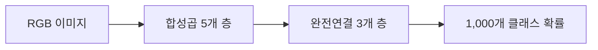

# 01. AlexNet — 이미지 특징을 직접 학습하는 CNN의 전환점

- **논문**: ImageNet Classification with Deep Convolutional Neural Networks
- **저자 / 발표**: Alex Krizhevsky, Ilya Sutskever, Geoffrey Hinton / NeurIPS 2012
- **한 줄 요약**: 대규모 이미지 데이터와 GPU를 활용해, 사람이 설계한 특징 대신 깊은 신경망이 분류에 필요한 표현을 학습할 수 있음을 보여줬다.
- **선행 지식**: 합성곱, 역전파, 분류, 과적합

## 1. 무엇이 문제였나?

이미지에서 물체를 찾으려면 조명·위치·배경 변화 속에서도 유용한 특징을 뽑아야 한다. AlexNet은 특징 추출과 최종 분류를 하나의 학습 과정으로 묶었다. 중요한 것은 CNN의 최초 발명이 아니라 **데이터 규모, 계산 자원, 학습 기법을 결합한 실증**이다.

## 2. 구조와 정보 흐름

중간에 ReLU와 max pooling을 사용한다. 완전연결 층 수에는 마지막 분류 층이 포함된다. 일부 합성곱 층의 GPU 간 연결을 제한한 것은 당시 메모리·계산 제약을 반영한다. LRN이라는 정규화도 사용하지만, 이를 모든 현대 CNN의 필수 요소로 볼 수는 없다.

## 3. 수식으로 이해하기

$$
h_{i,j,k}=\max\left(0,\sum_{u,v,c}W_{u,v,c,k}x_{i+u,j+v,c}+b_k\right)
$$

입력 $x$의 작은 영역에 필터 $W$를 적용해 출력 채널 $k$의 특징을 만든다. 같은 필터를 여러 위치에서 공유한다. ReLU는 음수 출력을 0으로 만든다.

**직접 생각해 보는 예시**: 컵이 사진의 왼쪽에서 오른쪽으로 이동해도 동일한 필터를 적용할 수 있다. 하지만 이것만으로 위치 변화에 완전히 불변인 분류기가 되는 것은 아니다. 잘라내기, 경계 처리, pooling, 후속 층의 영향을 함께 생각해야 한다.

## 4. 어떻게 학습했나?

ImageNet의 약 120만 학습 이미지와 1,000개 범주를 사용한다. 분류 cross-entropy를 SGD와 momentum으로 최적화하며, weight decay, 이미지 crop·좌우 반전, 색상 변형, 완전연결 층의 dropout으로 과적합을 줄인다. 학습률은 성능 정체에 따라 조정한다.

$$
\mathcal L=-\log p_\theta(y\mid x)
$$

**수식 해설**: 정답 클래스 확률이 0.1에서 0.5로 높아지면 손실은 약 2.30에서 0.69로 줄어든다. 높은 확률의 오답에 더 큰 벌점을 주는 구조다.

## 5. 실험을 어떻게 읽어야 하나?

ILSVRC 2012의 제출 시스템은 top-5 오류율 **15.3%**를 기록했다. 이 수치는 단일 네트워크 성능과 구분해야 한다. 원문 §6과 Table 2의 모델 조합 및 추가 학습 데이터 조건을 함께 읽자. 2010 데이터셋의 18.9%와도 다른 결과다.

Top-5 오류는 정답이 상위 다섯 후보에 없을 때 센다. 정확도 84.7%라는 표현만 쓰면 top-1 정확도로 오해할 수 있다.

## 6. 한계와 자주 하는 오해

분류 성능이 좋아도 위치 추정, 작은 물체 인식, 물리적 조작 능력을 직접 평가한 것은 아니다. 큰 완전연결 층은 많은 파라미터를 요구한다. ReLU가 학습에 도움을 주지만 모든 gradient 문제를 없애는 것도 아니다.

## 7. Physical AI와 연결해서 읽기 — 해설

[RT-1](../papers/01-rt1.md)을 읽을 때 카메라 이미지가 행동 모델에 들어가기 전에 어떤 표현으로 바뀌는지 살펴보자. 이미지 분류의 정답은 범주지만 로봇의 정답은 시간에 따른 행동이다. 따라서 좋은 시각 특징을 갖췄다는 사실과 좋은 제어 정책을 배웠다는 사실은 별개다.

다음은 [ResNet](02-resnet.md): 네트워크를 더 깊게 만들 때 학습이 어려워지는 문제를 다룬다.

## 8. 이해 확인

1. 필터를 위치마다 공유하면 파라미터 수가 왜 줄어드는가?
2. Dropout을 추론에서도 그대로 적용하면 어떤 차이가 생길까?
3. Top-1과 top-5 오류가 크게 다른 모델은 어떤 실패를 하고 있을까?

## 원문과 확인 위치

- [공식 논문 PDF](https://proceedings.neurips.cc/paper_files/paper/2012/file/c399862d3b9d6b76c8436e924a68c45b-Paper.pdf): §3 구조, §4 정규화, §5 학습, §6·Table 2 결과.

[전체 목록](README.md) · [용어집](GLOSSARY.md)
