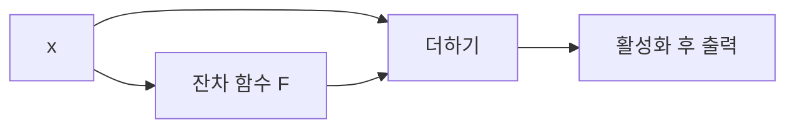

# 02. ResNet — 원래 표현에 보정값을 더하자

- **논문**: Deep Residual Learning for Image Recognition
- **저자 / 발표**: Kaiming He 외 / arXiv 2015, CVPR 2016
- **한 줄 요약**: 층이 전체 함수를 새로 만드는 대신 입력에 더할 잔차를 학습하도록 만들어, 깊은 네트워크의 최적화를 쉽게 했다.
- **선행 지식**: [AlexNet](01-alexnet.md), 역전파, 미분

## 1. 깊으면 항상 더 좋은가?

단순히 층을 쌓은 네트워크에서는 더 깊은 모델의 **훈련 오류 자체가 높아지는 degradation 문제**가 관찰된다. 검증 성능만 나빠지는 과적합과 구분해야 한다. 더 깊은 모델이 얕은 모델의 함수를 표현할 수 있다는 것과 실제 최적화가 그 해를 찾는다는 것은 다르다.

## 2. 핵심 구조

$$
y=F(x;W)+x
$$

$F$는 여러 층이 계산하는 잔차다. 입력과 출력의 차원이 다르면 projection shortcut으로 $W_sx$를 더한다. 기본 블록은 두 개의 3×3 합성곱을, 깊은 구성의 bottleneck은 1×1 → 3×3 → 1×1 합성곱을 사용한다. 원 논문의 블록에는 덧셈 뒤 활성화가 있으며, 후속 pre-activation 구조와 구분하자.

## 3. 왜 학습하기 쉬운가? — 수식 해설

덧셈 직후 출력에 대한 미분은 다음과 같다.

$$
\frac{\partial y}{\partial x}=I+\frac{\partial F}{\partial x}
$$

$I$라는 직접 경로가 있다는 뜻이다. 다만 실제 블록 전체에는 활성화 등도 있으므로 이 식만으로 모든 층의 gradient가 보존된다고 결론 내리면 안 된다.

**직접 만든 직관적 예시**: 이미 유용한 특징 $x$가 있다면 다음 층은 아주 작은 수정만 필요할 수 있다. 일반 층은 $x$를 다시 만들어야 하지만 잔차 층은 $F(x)\approx0$이면 된다. 문서 초안을 매번 새로 쓰는 대신 수정 사항을 추가하는 경우를 떠올리면 이해하기 쉽다.

## 4. 학습 방법

ImageNet 지도학습에 SGD, momentum, weight decay, 데이터 증강, batch normalization을 사용한다. 잔차 연결 자체에 별도의 잔차 정답을 제공하지 않는다. 최종 분류 손실을 역전파하면 내부의 $F$도 함께 학습된다.

이 점을 놓치면 “정답 특징에서 입력 특징을 뺀 데이터셋이 필요한가?”라는 오해가 생긴다. 필요한 정답은 여전히 이미지의 클래스다.

## 5. 실험 결과와 해석

152층 모델을 평가했고, 앙상블은 ILSVRC 2015 테스트의 top-5 오류율 **3.57%**를 기록했다. 이는 단일 ResNet-152의 정확도가 아니다. 원문 Figure 1의 plain network 훈련 오류와 Table 2~4의 서로 다른 평가 조건을 나눠 읽자.

깊이 증가의 이득이 분류 외 검출 과제에도 이어지는지 평가한다는 점이 중요하다. 같은 정확도라도 연산량과 파라미터 수가 같지는 않다.

## 6. 한계

잔차 연결은 데이터 부족, 분포 변화, 과적합을 자동으로 해결하지 않는다. 층을 늘리면 메모리와 실행 시간이 증가한다. 초깊은 모델의 결과를 “깊을수록 무조건 좋다”는 법칙으로 읽으면 안 된다.

## 7. 다음 연구와 Physical AI 연결 — 해설

[Transformer](03-transformer.md)의 attention과 feed-forward 부분에도 잔차 연결이 등장한다. 모듈의 종류가 바뀌어도 기존 표현을 유지하며 수정하는 발상은 활용할 수 있다.

로봇의 시각 backbone을 볼 때에는 “ResNet인가?”뿐 아니라 사전학습 데이터, 출력 해상도, 지연 시간을 확인하자. [OpenVLA](../papers/04-openvla.md)의 시각 표현을 읽는 데도 이런 질문이 유용하다.

## 8. 이해 확인

1. 훈련 오류 상승과 검증 오류 상승은 각각 무엇을 시사하는가?
2. 입력 64채널, 출력 128채널일 때 그대로 더할 수 있는가?
3. 잔차 연결이 있어도 계산 비용은 왜 증가하는가?

## 원문과 확인 위치

- [논문](https://arxiv.org/abs/1512.03385): §3.1~3.3 잔차·shortcut·구조, §4.1 ImageNet 결과.

[전체 목록](README.md) · [용어집](GLOSSARY.md)
