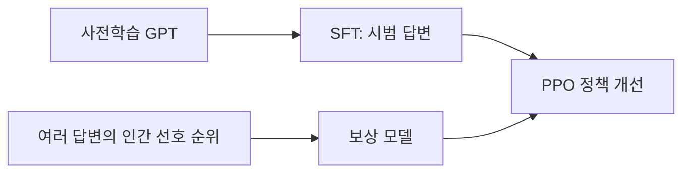

# 07. InstructGPT — 사람이 원하는 답변을 학습시키기

- **논문**: Training language models to follow instructions with human feedback
- **저자 / 발표**: Long Ouyang 외 / NeurIPS 2022
- **한 줄 요약**: 시범 답변과 사람의 선호 비교를 이용해 사전학습 언어 모델의 행동을 조정한다.
- **선행 지식**: [GPT-3](05-gpt3.md), 확률·손실; [PPO](19-ppo.md)는 후속 참고

## 1. 다음 토큰 예측만으로 충분한가?

웹 문장을 잘 이어 쓰는 목표와 사용자의 요청에 유용하게 답하는 목표는 같지 않다. 지시 뒤에 답 대신 또 다른 질문을 이어 쓰는 것도 언어 모델 관점에서는 그럴듯할 수 있다. 이 차이를 줄이기 위한 사후학습이 주제다.

## 2. 세 단계

SFT는 정답 답변의 토큰 확률을 높인다. 보상 모델은 같은 요청에 대한 선호 답변을 더 높게 평가한다. PPO 단계에서는 모델이 답변을 생성하고 그 보상으로 정책을 조정한다. 사람이 매번 모든 생성 토큰의 정답을 작성하는 방식은 아니다.

## 3. 보상 모델과 정책 목적

$$
\mathcal L_{RM}
=-\mathbb E\log\sigma\left(r_\phi(x,y_w)-r_\phi(x,y_l)\right)
$$

$x$는 요청, $y_w$는 선호 답변, $y_l$은 비선호 답변이다. 점수의 차이가 중요하다.

설명을 위한 정책 목표의 축약형은 다음과 같다.

$$
\max_\theta\ 
\mathbb E_{x,y\sim\pi_\theta}\left[r_\phi(x,y)\right]
-\beta\mathbb E_x D_{KL}(\pi_\theta(\cdot\mid x)\Vert\pi_{ref}(\cdot\mid x))
$$

원문의 PPO-ptx에는 사전학습 데이터의 로그우도 항도 추가된다. 위 식은 PPO의 clipping 구현 전체를 나타내는 식이 아니다.

## 4. 수식의 직관 — 직접 만든 예시

두 답변의 점수가 3과 1이면 선호 차이는 2다. 둘 다 10을 더해도 차이는 같으므로 이 비교의 확률은 변하지 않는다. 보상 점수를 절대적인 “정확도 90점”처럼 읽으면 안 된다.

KL 항은 기준 정책에서 지나치게 벗어나는 것을 억제한다. 그렇다고 거짓 답변의 확률을 0으로 만드는 사실성 검증기는 아니다.

## 5. 실험 결과

해당 API 요청 분포의 인간 평가에서 **1.3B InstructGPT가 175B GPT-3보다 선호**됐다. 모든 지식·추론 과제에서 작은 모델이 더 뛰어나다는 뜻은 아니다. 원문 Figure 1의 평가 기준, 응답 비교 대상, 신뢰구간을 확인하자.

학습에는 API 요청과 평가자 작성 요청, 시범 답변, 답변 순위가 쓰인다. SFT만 한 모델과 PPO/PPO-ptx의 차이를 비교하는 것이 중요하다.

## 6. 한계와 오해

선호 라벨은 평가자 집단과 지침을 반영한다. 보상 모델의 허점을 활용하는 reward hacking, 일반 능력의 성능 저하, 사실 오류가 남을 수 있다. RLHF라는 이름만으로 보편적 인간 가치나 진실을 학습했다고 결론 내릴 수 없다.

## 7. Physical AI 연결 — 해설

[π*0.6](../papers/07-pi06.md)처럼 경험과 평가 신호를 다루는 글에서는 무엇이 보상이고 무엇이 행동 정답인지 구별하자. 이 연결은 목표를 비교하기 위한 해설이며 해당 로봇 논문이 InstructGPT의 PPO 파이프라인을 그대로 쓴다는 주장은 아니다.

## 8. 이해 확인

1. 선호 비교 데이터와 시범 답변 데이터는 어떻게 다른가?
2. 보상 증가와 실제 사용자 만족이 어긋날 수 있는 이유는?
3. KL 계수를 지나치게 크게 하면 정책 개선은 어떻게 될까?

## 원문과 확인 위치

- [논문](https://arxiv.org/abs/2203.02155): §3 방법·식 (1)~(2), §4 결과, §5 한계, 부록의 평가 지침.

[전체 목록](README.md) · [용어집](GLOSSARY.md)
