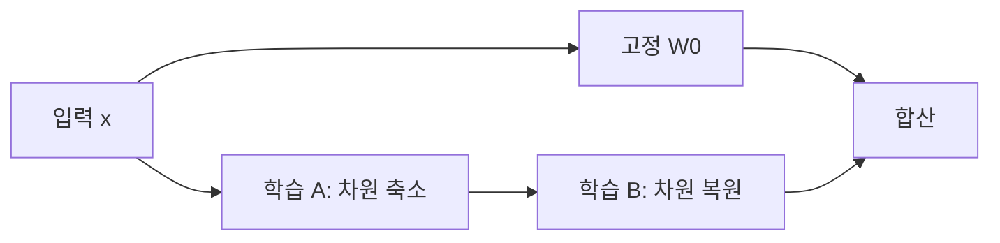

# 08. LoRA — 작은 행렬로 큰 모델을 미세조정하기

- **논문**: LoRA: Low-Rank Adaptation of Large Language Models
- **저자 / 발표**: Edward J. Hu 외 / arXiv 2021, ICLR 2022
- **약자**: Low-Rank Adaptation
- **한 줄 요약**: 원래 가중치를 고정하고 변화량만 저랭크 행렬의 곱으로 학습한다.
- **선행 지식**: 행렬 크기, rank, [Transformer](03-transformer.md)

## 1. 무엇을 줄이려는가?

전체 미세조정은 대형 가중치마다 gradient와 optimizer state를 관리해야 한다. 과제마다 전체 복사본을 저장하는 부담도 크다. LoRA는 적응에 필요한 변화가 낮은 차원으로 표현될 수 있다는 가정 아래 학습 파라미터를 줄인다.

## 2. 핵심 구조

$$
W=W_0+\frac{\alpha}{r}BA
$$

$$
W_0\in\mathbb R^{d_{out}\times d_{in}},\quad
A\in\mathbb R^{r\times d_{in}},\quad
B\in\mathbb R^{d_{out}\times r}
$$

$W_0$는 고정, $A,B$만 학습한다. $r$은 rank 설정, $\alpha$는 크기를 조절하는 계수다. 원 논문은 $A$를 무작위, $B$를 0으로 초기화해 초기 변화량을 0으로 둔다.

## 3. 파라미터 수를 직접 계산하기

4,096×4,096 가중치를 생각하자. 전체는 16,777,216개다. $r=8$이면 LoRA 파라미터는 다음과 같다.

$$
r(d_{in}+d_{out})=8(4096+4096)=65,536
$$

이 한 행렬에 대해서는 약 0.39%다. **모델 전체의 메모리가 0.39%가 된다는 뜻은 아니다.** 고정된 backbone, activation, 다른 학습 모듈의 메모리가 남는다.

이 계산은 설명용 예시이며 논문의 특정 실험 모델 전체 수치가 아니다.

## 4. 학습과 추론

LoRA는 새로운 정답 형식이나 손실함수가 아니라 파라미터화 방식이다. 분류나 언어 모델링 등 원래 과제의 손실로 $A,B$를 학습한다. 추론 때 지원되는 설정에서는 $W_0+(\alpha/r)BA$를 하나의 가중치로 병합해 별도 분기를 없앨 수 있다.

원 논문에서는 Transformer attention 가중치에 적용하며 어느 행렬을 조정하는지, rank를 얼마로 두는지를 비교한다.

## 5. 실험 결과를 읽는 기준

RoBERTa, DeBERTa, GPT-2, GPT-3의 평가에서 적은 학습 파라미터로 전체 미세조정에 견줄 만한 결과를 보였다. 원문의 “학습 파라미터 감소”와 “GPU 메모리 감소”는 서로 다른 지표다. 모든 과제에서 항상 성능이 같다는 보장은 아니다.

## 6. 한계와 흔한 혼동

Rank가 너무 작으면 필요한 변화를 표현하기 어렵다. 적용 층, 학습률, 데이터 양에 따라 결과가 달라진다. 원 LoRA 자체는 가중치 양자화 기법이 아니며, QLoRA는 구분해서 읽어야 한다.

**추가 사고 실험**: 두 과제의 LoRA를 단순히 더하면 두 능력이 완벽히 합쳐질까? 각 변화량이 같은 backbone에서 서로 간섭할 수 있으므로 병합 가능성과 성능 보장은 별개다.

## 7. Physical AI 연결 — 해설

[OpenVLA](../papers/04-openvla.md)의 새 로봇 적응을 읽을 때 전체 모델과 일부 모듈 중 무엇이 업데이트되는지 확인하자. 적은 학습 파라미터는 유용하지만 로봇 action 표현이나 데이터 품질을 대신 해결해 주지는 않는다.

다음은 [RAG](09-rag.md): 가중치를 조정하는 방법과 외부 지식을 읽히는 방법을 비교하자.

## 8. 이해 확인

1. $BA$의 rank가 왜 최대 $r$인가?
2. $A,B$를 둘 다 0으로 시작하면 gradient에 어떤 문제가 생기는가?
3. LoRA 병합과 양자화는 각각 무엇을 바꾸는가?

## 원문과 확인 위치

- [논문](https://arxiv.org/abs/2106.09685): §4 저랭크 파라미터화, §5 결과, §7 rank·적용 행렬 분석.

[전체 목록](README.md) · [용어집](GLOSSARY.md)
