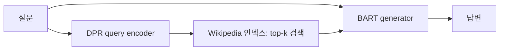

# 09. RAG — 검색한 문서를 조건으로 답변 생성하기

- **논문**: Retrieval-Augmented Generation for Knowledge-Intensive NLP Tasks
- **저자 / 발표**: Patrick Lewis 외 / NeurIPS 2020
- **한 줄 요약**: 신경망 내부 지식에 검색 가능한 외부 문서를 결합한다.
- **선행 지식**: [BERT](04-bert.md), 조건부확률, encoder–decoder

## 1. 왜 검색을 붙이는가?

가중치 안에 저장된 지식은 수정하기 어렵고 출처를 추적하기도 어렵다. RAG는 문서 인덱스를 외부 기억으로 사용한다. 검색을 쓴다는 이유만으로 모든 답이 근거에 충실해지는 것은 아니다.

## 2. 원 논문의 구조

DPR은 질문·문서를 벡터로 표현하고 유사한 문서를 찾는다. BART는 질문과 검색 문서를 조건으로 답변을 생성한다. 원 실험은 2018년 Wikipedia를 100단어 단위로 나눈 약 21M passages를 사용한다.

## 3. 두 가지 확률 모델

$$
p_{seq}(y\mid x)\approx\sum_{z\in top\text{-}k}
p_\eta(z\mid x)\prod_t p_\theta(y_t\mid x,z,y_{<t})
$$

$$
p_{tok}(y\mid x)\approx\prod_t\sum_{z\in top\text{-}k}
p_\eta(z\mid x)p_\theta(y_t\mid x,z,y_{<t})
$$

$x$는 질문, $z$는 문서, $y$는 답변이다. RAG-Sequence는 답변 전체에 대한 문서 가설을 합산하고, RAG-Token은 토큰마다 문서별 예측을 합산한다. 후자가 토큰마다 웹 검색을 새로 수행한다는 뜻은 아니다.

## 4. 직접 만든 계산 예시

두 문서의 검색 확률이 0.7, 0.3이고 답변 후보의 문서별 확률이 0.2, 0.8이면 주변화한 확률은 $0.7\times0.2+0.3\times0.8=0.38$이다. 검색 순위 1등 문서만 사용한 0.2와 다르다.

이 예시는 문서를 잠재변수로 취급한다는 뜻을 보여준다. 원 논문의 방식과 검색 결과를 모두 하나의 긴 프롬프트에 붙이는 일반적인 응용 파이프라인을 동일시하면 안 된다.

## 5. 학습과 실험

정답 답변의 음의 주변 로그우도를 최소화한다. Query encoder와 generator를 업데이트하며, 문서 encoder와 인덱스는 고정한다. 질문별 정답 문서 라벨 없이도 답변 손실로 공동 미세조정한다.

Open-domain QA, 생성형 QA, 사실 검증을 평가한다. 원문 Table 1 및 §4에서 retrieval 없는 모델과 비교하고, index 교체 실험에서 외부 기억 갱신의 효과를 보자.

## 6. 한계 — 시스템 관점의 해설

정답 문서를 못 찾는 **검색 실패**, 찾았지만 잘못 읽는 **생성 실패**를 나눠야 한다. 문서가 최신이어도 잘못된 내용을 담을 수 있고, 답변에 링크가 있어도 그 문장이 출처에 의해 뒷받침되는지는 별도 확인이 필요하다.

**직접 만든 사례**: 장비 A의 사용법을 물었는데 이름이 비슷한 장비 B의 문서가 검색됐다면, 문장을 유창하게 요약해도 답은 틀리다. Retrieval recall과 답변 정확도를 따로 측정해야 원인을 알 수 있다.

## 7. Physical AI 연결 — 해설

로봇이 매뉴얼을 참고하는 설계를 생각할 때 유용하다. 그러나 문서 검색은 실제 카메라 상태, 충돌 가능성, 행동 실행의 정당성을 검증하는 제어기가 아니다. [RT-2](../papers/02-rt2.md)의 가중치에 내재한 웹 지식 전이와도 구분하자.

[LoRA](08-lora.md)는 가중치를 조정하고, RAG는 외부 정보를 제공한다. 두 방법은 병용 가능하다.

## 8. 이해 확인

1. RAG-Sequence와 RAG-Token에서 합과 곱의 순서가 왜 중요한가?
2. 문서 encoder를 업데이트하면 인덱스에 어떤 문제가 생기는가?
3. 정답 문서를 제공해도 틀릴 때 어느 부분을 점검해야 할까?

## 원문과 확인 위치

- [논문](https://arxiv.org/abs/2005.11401): §2.1 확률 모델, §2.4 학습, §3 데이터, §4.5 retrieval 분석.

[전체 목록](README.md) · [용어집](GLOSSARY.md)
