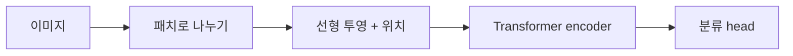

# 10. ViT — 이미지를 패치 토큰의 시퀀스로 보기

- **논문**: An Image is Worth 16x16 Words: Transformers for Image Recognition at Scale
- **저자 / 발표**: Alexey Dosovitskiy 외 / arXiv 2020, ICLR 2021
- **약자**: Vision Transformer
- **한 줄 요약**: 이미지를 작은 패치들로 바꾸고 Transformer encoder로 분류한다.
- **선행 지식**: [Transformer](03-transformer.md), [ResNet](02-resnet.md)

## 1. 문제의식

CNN의 지역성·가중치 공유는 이미지 학습에 유리한 가정을 제공한다. ViT는 충분한 사전학습 데이터가 있을 때 이런 CNN 중심 구조 없이도 Transformer가 강한 시각 표현을 만들 수 있는지 확인한다.

## 2. 이미지에서 토큰까지

이미지 크기 $H\times W$, 패치 한 변 $P$라면 패치 수는 다음과 같다.

$$
N=\frac{HW}{P^2}
$$

각 패치의 픽셀을 펼쳐 선형 투영하고 위치 임베딩을 더한다. 분류 토큰을 추가한 뒤 Transformer encoder를 통과시킨다.

$$
z_0=[x_{cls};x_p^1E;\dots;x_p^NE]+E_{pos}
$$

$E$는 패치 투영 행렬이다. 이미지 패치는 텍스트 사전의 정수 ID와 동일한 토큰화가 아니다. 연속 벡터로 투영된 입력 단위다.

## 3. 해상도와 비용 — 직접 계산하기

224×224 이미지에 16×16 패치를 쓰면 14×14, 즉 196개 패치가 생긴다. CLS를 더하면 197개 토큰이다.

해상도를 양쪽 모두 두 배로 하면 패치 수는 네 배가 된다. Dense attention 점수 행렬의 원소 수는 CLS를 무시하면 약 16배다. 전체 모델 비용이 정확히 16배라는 뜻은 아니며, 토큰별 MLP·투영 비용도 따로 존재한다.

## 4. 학습 방법

대규모 이미지 분류 사전학습 후 목표 데이터셋에 미세조정한다. ImageNet, ImageNet-21k, JFT-300M 규모를 비교한다. 학습은 지도 분류 목적을 사용한다. ViT라는 구조 자체가 자동으로 자기지도학습을 의미하지는 않는다.

높은 해상도로 전이할 때 패치 수가 바뀌므로 위치 임베딩 보간이 필요하다. 원문의 학습 설정은 현대 ViT 변형들의 설정과 구분하자.

## 5. 실험 결과의 핵심

작은 데이터 조건에서는 CNN의 inductive bias가 도움이 되지만, 큰 사전학습 데이터에서는 ViT가 강한 전이 성능을 보인다. 원문 Table 2와 데이터 크기 분석을 함께 읽자. 정확도만 보고 사전학습 데이터와 연산 예산의 차이를 생략하면 구조의 효과를 과장할 수 있다.

## 6. 한계와 오해

큰 패치는 작은 물체의 세부 정보를 표현하는 데 불리할 수 있다. 작은 패치는 토큰 수와 연산을 늘린다. “16×16”은 논문 제목에 등장한 설정이며 모든 ViT의 고정 패치 크기는 아니다.

**해설용 질문**: 같은 컵 손잡이가 한 패치 안에 들어갈 때와 여러 패치에 걸칠 때, 모델이 어느 단계에서 관계를 결합해야 할까? 패치 경계와 global attention의 역할을 나눠 생각해 보자.

## 7. Physical AI 연결 — 해설

[OpenVLA](../papers/04-openvla.md) 같은 시각 기반 정책에서 이미지 토큰 수는 지연 시간과 메모리에 영향을 준다. 카메라 수·프레임 수까지 늘면 입력 규모가 더 커진다. 해상도 상승이 항상 실시간 제어 성능 향상으로 이어지는지는 측정해야 한다.

다음 읽기: [CLIP](11-clip.md). ViT는 구조이고, CLIP은 이미지와 텍스트를 함께 학습하는 방식이다.

## 8. 이해 확인

1. 384×384 이미지에 16×16 패치를 쓰면 패치 수는?
2. CLS 토큰과 위치 임베딩은 각각 어떤 역할을 하는가?
3. 데이터 양이 같지 않은 비교에서 아키텍처의 우열을 바로 판단할 수 있을까?

## 원문과 확인 위치

- [논문](https://arxiv.org/abs/2010.11929): §3.1 구조·식 (1), §3.2 전이, §4 데이터·성능·분석.

[전체 목록](README.md) · [용어집](GLOSSARY.md)
