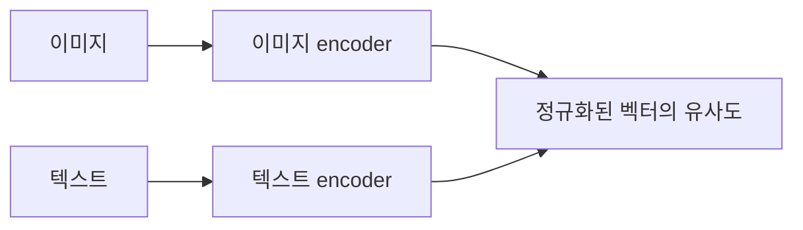

# 11. CLIP — 이미지와 문장을 같은 공간에 정렬하기

- **논문**: Learning Transferable Visual Models From Natural Language Supervision
- **저자 / 발표**: Alec Radford 외 / ICML 2021
- **약자**: Contrastive Language–Image Pre-training
- **한 줄 요약**: 맞는 이미지–문장 쌍의 유사도를 높여 자연어로 시각 범주를 지정할 수 있게 한다.
- **선행 지식**: [ViT](10-vit.md), cosine similarity, cross-entropy

## 1. 고정된 분류 라벨을 넘어서

일반 분류기는 정해진 클래스 집합에 맞춰 학습한다. CLIP은 웹의 이미지–텍스트 쌍을 이용하고, 새로운 과제에서는 후보 클래스 설명을 텍스트 encoder에 넣어 비교한다.

## 2. 구조

이미지 encoder와 텍스트 encoder가 각각 입력을 벡터로 만들고 정규화한다. 이미지 encoder로 ResNet 및 ViT 계열을 평가한다. **CLIP 자체는 자유로운 문장 답변을 생성하는 chatbot이 아니다.**

## 3. 대조학습 수식

배치 크기 $N$에서 올바른 쌍을 $(I_i,T_i)$라 하자.

$$
s_{ij}=\frac{v_i^\top t_j}{\tau}
$$

$$
\mathcal L_{I\to T}
=-\frac1N\sum_i\log\frac{\exp(s_{ii})}{\sum_j\exp(s_{ij})}
$$

텍스트→이미지 방향도 계산해 두 손실을 평균한다. $\tau$는 유사도 분포의 날카로움을 조절하는 temperature 표기다. 원 논문은 학습 가능한 logit scale을 사용한다.

## 4. 직접 만든 3쌍 예시

배치에 “컵 사진–컵 설명”, “자동차 사진–자동차 설명”, “고양이 사진–고양이 설명”이 있다면 3×3 유사도 행렬의 대각선이 정답이다. 각 이미지가 세 문장 중 자기 설명을 고르게 한다.

다만 다른 사진에도 컵이 있으면 비정답 쌍이 의미상 틀리지 않을 수 있다. 대조학습의 배치 정답과 현실의 의미 관계는 완전히 일치하지 않을 수 있음을 보여주는 예시다.

## 5. 학습과 zero-shot 평가

4억 이미지–텍스트 쌍으로 사전학습한다. 추론에서는 “a photo of a {class}” 같은 후보 설명을 만들어 이미지와 비교한다. 후보 텍스트의 구성과 여러 프롬프트의 앙상블이 성능에 영향을 준다.

원문은 30개 이상의 시각 데이터셋을 평가하고, ImageNet의 zero-shot 전이가 지도학습 ResNet-50 수준에 도달하는 사례를 보인다. 원문 §3의 모델·프롬프트·평가 조건을 함께 읽자.

## 6. 한계와 오해

Zero-shot은 **해당 downstream 과제의 라벨로 추가 학습하지 않는다**는 의미다. 세상의 모든 평가 개념을 처음 본다는 보장은 아니다. 객체 수 세기, 공간 관계, 세밀한 구성 관계와 데이터 편향에도 한계가 있다.

**해설**: “빨간 컵 옆의 파란 상자”와 “파란 컵 옆의 빨간 상자”는 단어가 거의 같지만 장면은 다르다. 단순한 범주 정렬과 정확한 관계 이해를 분리해 시험해 보자.

## 7. VLM과 Physical AI 연결 — 해설

[LLaVA](12-llava.md)는 시각 특징을 언어 생성 모델에 연결한다. 따라서 CLIP을 이해하면 “시각 encoder”와 “답을 쓰는 LLM”의 역할을 구분하기 쉬워진다.

[RT-2](../papers/02-rt2.md) 같은 VLA를 읽을 때도 이미지–언어 이해와 실제 action 출력 사이에 어떤 추가 학습이 있는지 확인하자. 물체 이름을 맞히는 능력과 집는 능력은 다른 목표다.

## 8. 이해 확인

1. 배치 크기 $N$일 때 유사도 쌍은 몇 개인가?
2. Temperature가 작아지면 확률 분포는 어떻게 변하는가?
3. 후보 클래스 설명을 바꾸면 zero-shot 결과가 왜 달라질 수 있는가?

## 원문과 확인 위치

- [논문](https://arxiv.org/abs/2103.00020): §2 방법·Figure 3, §3 전이 평가, §6 한계·§7 사회적 영향.

[전체 목록](README.md) · [용어집](GLOSSARY.md)
