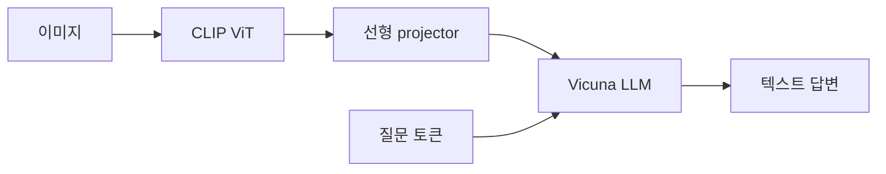

# 12. LLaVA — 이미지에 관해 대화하는 VLM

- **논문**: Visual Instruction Tuning
- **저자 / 발표**: Haotian Liu, Chunyuan Li, Qingyang Wu, Yong Jae Lee / NeurIPS 2023
- **약자**: Large Language and Vision Assistant
- **한 줄 요약**: 사전학습 시각 encoder와 LLM을 연결하고 이미지 기반 지시 데이터로 답변을 학습한다.
- **범위**: 최초 LLaVA 논문; LLaVA-1.5 이후 구성과 구분
- **선행 지식**: [CLIP](11-clip.md), [GPT-3](05-gpt3.md), SFT

## 1. 왜 연결만으로는 부족한가?

이미지 벡터를 구할 수 있고 LLM이 말을 잘해도, LLM이 그 벡터를 해석해 질문에 답하도록 학습된 것은 아니다. LLaVA는 표현 연결과 visual instruction tuning을 함께 다룬다.

## 2. 구조

$$
Z_v=g(X_v),\qquad H_v=WZ_v
$$

$g$는 CLIP ViT-L/14 시각 encoder, $W$는 학습 가능한 선형 projection이다. $H_v$는 언어 임베딩 차원에 맞춘 시각 토큰이며, 텍스트와 함께 Vicuna에 입력된다. 최초 구조의 선형 projection을 후속 버전의 MLP projector와 혼동하지 말자.

## 3. 두 단계 학습

| 단계 | 데이터·목적 | 업데이트 |
|---|---|---|
| 표현 정렬 | 필터링한 CC3M 595K 이미지–텍스트 쌍 | Projector |
| 지시 미세조정 | 158K 시각 지시 데이터 등 | Projector + LLM |

두 단계 모두 시각 encoder는 고정한다. 답변 토큰의 autoregressive cross-entropy를 계산한다.

$$
\mathcal L=-\sum_{t\in\text{assistant tokens}}
\log p_\theta(y_t\mid I,q,y_{<t})
$$

## 4. 지시 데이터는 어떻게 만들었나?

GPT-4에 이미지의 caption·bounding box 같은 **텍스트로 표현한 정보**를 제공해 대화, 상세 설명, 추론 형태의 데이터를 생성했다. 최초 논문의 데이터 생성 과정을 “GPT-4가 원본 이미지를 직접 보고 정답을 만들었다”로 요약하면 부정확하다.

## 5. 직접 만든 예시로 이해하기

이미지에 컵 두 개가 있고 사용자가 “왼쪽 컵은 무슨 색이야?”라고 묻는다고 하자. 모델은 물체 이름뿐 아니라 질문의 대상, 좌우 관계, 색을 연결해야 한다.

**사고 실험**: 질문을 “오른쪽 컵”으로만 바꾸거나 이미지를 좌우 반전해 보자. 답이 변해야 할 조건에서 그대로라면 이미지보다 언어적 추측에 의존할 가능성을 의심할 수 있다. 이것은 본 노트의 검증 아이디어이며 논문의 보고 실험은 아니다.

## 6. 실험과 해석

시각 대화 평가와 ScienceQA를 사용한다. GPT-4 기반 답변 평가와 정답이 정해진 과학 QA는 다른 지표다. ScienceQA에서 LLaVA 단독 결과와 GPT-4 결합 결과를 분리해서 봐야 한다. 후자를 그대로 단독 VLM 정확도로 인용하면 안 된다.

## 7. 한계와 Physical AI 연결 — 해설

이미지에 없는 내용을 말하는 hallucination, 작은 글자·정밀 공간 관계의 오류가 가능하다. 합성 지시 데이터에도 오류와 편향이 들어갈 수 있다.

[GR00T N1](../papers/08-groot-n1.md)을 읽을 때 VLM의 역할을 이해하는 좋은 출발점이다. 다만 LLaVA의 출력은 텍스트이며 관절 명령이 아니다. VLM을 VLA로 확장하려면 행동 표현, 로봇 데이터, 제어 시간 구조를 추가로 이해해야 한다.

## 8. 이해 확인

1. 이미지 encoder와 LLM의 차원이 다를 때 projector가 하는 일은?
2. 첫 단계에서 두 backbone을 고정하는 목적은 무엇인가?
3. 텍스트 답변이 맞는 것과 로봇이 그 행동을 성공하는 것은 왜 다른가?

## 원문과 확인 위치

- [논문](https://arxiv.org/abs/2304.08485): §3 데이터, §4.1 구조, §4.2 두 단계 학습, §5 평가.

[전체 목록](README.md) · [용어집](GLOSSARY.md)
