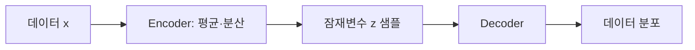

# 13. VAE — 잠재변수와 확률적 생성 모델

- **논문**: Auto-Encoding Variational Bayes
- **저자 / 발표**: Diederik P. Kingma, Max Welling / arXiv 2013, ICLR 2014
- **약자**: Variational Autoencoder
- **한 줄 요약**: 다루기 어려운 잠재변수 모델의 학습을 변분추론과 reparameterization으로 가능하게 한다.
- **선행 지식**: Gaussian, 기대값, 조건부확률, 미분

## 1. 무엇이 어려운가?

데이터 $x$가 잠재변수 $z$에서 생성된다고 놓으면 다음 적분이 필요하다.

$$
p_\theta(x)=\int p_\theta(x\mid z)p(z)\,dz
$$

일반적인 신경망 decoder에서는 이 적분과 posterior $p(z\mid x)$를 정확히 계산하기 어렵다. VAE는 encoder $q_\phi(z\mid x)$로 posterior를 근사한다.

## 2. Encoder와 decoder

Encoder는 보통 $z$ 하나를 바로 출력하는 대신 Gaussian의 평균과 분산을 출력한다. Decoder는 $z$로부터 데이터의 분포를 정의한다. “압축했다가 복원하는 네트워크”라는 직관만으로는 확률모델과 정규화의 역할을 놓치기 쉽다.

## 3. ELBO의 의미

$$
\log p_\theta(x)\ge
\underbrace{\mathbb E_{q_\phi(z\mid x)}\log p_\theta(x\mid z)}_{\text{재구성}}
-
\underbrace{D_{KL}(q_\phi(z\mid x)\Vert p(z))}_{\text{prior와의 차이}}
$$

우변인 evidence lower bound를 최대화한다. 재구성만 좋게 하면 잠재공간이 생성에 불편해질 수 있고, prior만 맞추면 입력 정보가 사라질 수 있다. 두 항의 균형이 중요하다.

## 4. Reparameterization trick

$$
z=\mu_\phi(x)+\sigma_\phi(x)\odot\epsilon,
\qquad\epsilon\sim\mathcal N(0,I)
$$

난수를 별도 변수 $\epsilon$로 분리하고, $\mu,\sigma$에 대해 미분 가능한 계산을 구성한다.

**직접 계산**: 한 차원에서 $\mu=2,\sigma=0.5,\epsilon=-1$이면 $z=1.5$다. 같은 난수 표본을 두고 $\mu$를 조금 바꾸면 $z$도 같은 양만큼 변한다. 이 경로를 통해 encoder에 gradient가 전달된다.

표준정규 prior와 대각 Gaussian posterior라면 KL 항도 해석적으로 계산할 수 있다.

$$
D_{KL}=\frac12\sum_j
\left(\mu_j^2+\sigma_j^2-1-\log\sigma_j^2\right)
$$

## 5. 학습·생성·실험

학습은 데이터 미니배치에서 ELBO의 확률적 추정값으로 encoder와 decoder를 함께 업데이트한다. 생성 시에는 입력 이미지 없이 prior에서 $z$를 뽑아 decoder에 넣는다. 원문은 MNIST·Frey Face 등에서 학습과 추론의 효율을 평가한다.

새 이미지 생성과 입력 복원은 다른 절차다. 현대 고해상도 생성 모델의 수치를 초기 VAE 논문의 결과로 옮겨 적으면 안 된다.

## 6. 한계 — 해설

단순한 likelihood와 제한된 표현은 흐릿한 복원으로 이어질 수 있다. KL이 강하거나 decoder가 입력 없이도 설명을 잘하면 $z$를 덜 사용하는 현상도 생각할 수 있다. 좋은 복원 손실과 사람이 보는 좋은 샘플은 동일 지표가 아니다.

## 7. 다음 연구와 Physical AI 연결 — 해설

[Latent Diffusion](16-latent-diffusion.md)을 읽기 위한 기초다. 다만 그 압축 autoencoder가 이 논문의 기본 구성과 완전히 같은 것은 아니다.

[Cosmos](../papers/10-cosmos.md) 같은 world model을 볼 때 “latent가 무엇을 보존하고 무엇을 버리는가?”를 질문해 보자. 예쁜 복원에 덜 중요한 작은 물체가 실제 제어에는 중요할 수 있다.

## 8. 이해 확인

1. 입력 복원과 prior 기반 생성은 $z$를 어디서 얻는가?
2. KL 항이 없으면 prior에서 뽑은 샘플의 품질에 어떤 문제가 생길까?
3. Reparameterization이 난수 자체를 없애는 것은 왜 아닌가?

## 원문과 확인 위치

- [논문](https://arxiv.org/abs/1312.6114): §2 변분추론·재매개화, §3 VAE, §5 실험, Gaussian KL 부록.

[전체 목록](README.md) · [용어집](GLOSSARY.md)
