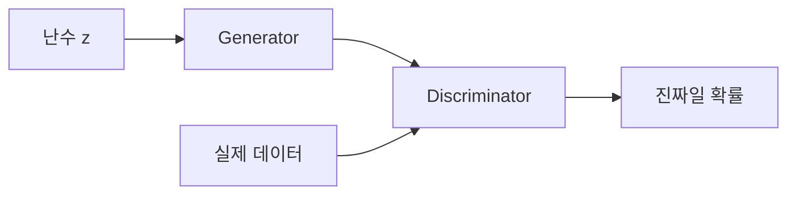

# 14. GAN — 생성자와 판별자의 경쟁으로 분포 학습하기

- **논문**: Generative Adversarial Nets (학회 제목; arXiv 제목: Generative Adversarial Networks)
- **저자 / 발표**: Ian J. Goodfellow 외 / NeurIPS 2014
- **약자**: Generative Adversarial Network
- **한 줄 요약**: 가짜 샘플을 만드는 생성자와 진짜·가짜를 구분하는 판별자를 함께 학습한다.
- **선행 지식**: 확률, 분류 손실, 미분

## 1. 문제의식

생성 모델은 데이터를 그럴듯하게 만들어야 한다. GAN은 복잡한 likelihood를 직접 계산하는 대신, 학습되는 판별자가 생성 결과에 피드백을 제공하게 한다.

## 2. 구조와 목표

$$
\min_G\max_D V(D,G)=
\mathbb E_{x\sim p_{data}}\log D(x)
+\mathbb E_{z\sim p(z)}\log(1-D(G(z)))
$$

$G$는 난수 $z$를 샘플로 바꾸고, $D$는 진짜 데이터일 확률을 출력한다. $D$를 업데이트할 때와 $G$를 업데이트할 때의 목적이 다르다.

생성자 학습 때도 판별자를 통과하는 미분이 필요하다. 판별자의 파라미터를 그 단계에 업데이트하지 않는다는 것과 계산 경로를 끊는 것은 다르다.

## 3. 실제 학습의 중요한 세부 사항

초기 생성 샘플이 너무 나쁘면 minimax 생성자 목적에서 gradient가 약해질 수 있다. 원문은 생성자가 $\log D(G(z))$를 최대화하는 non-saturating 대안도 제시한다. 추론에서는 생성자만 사용한다.

이상적인 함수 공간과 충분한 최적화에서는 $p_g=p_{data}$, $D=1/2$인 해를 논의한다. 유한 신경망의 실제 학습이 반드시 그 해에 수렴한다는 보장은 아니다.

## 4. 직접 만든 예시 — 다양성과 품질

숫자 0~9가 있는 데이터에서 생성자가 아주 선명한 7만 만든다고 하자. 몇 장만 보면 좋지만 데이터 전체의 분포는 재현하지 못한다. 이것이 mode collapse를 이해하기 위한 예시다.

따라서 아래 질문을 나눠야 한다.

- 개별 샘플은 그럴듯한가?
- 서로 다른 샘플은 충분히 다양한가?
- 학습 데이터를 그대로 복사했는가?
- 특정 범주를 빠뜨렸는가?

## 5. 원 논문의 실험

MNIST, Toronto Face Database, CIFAR-10에서 샘플과 정량 평가를 제시한다. 원 논문은 후속 DCGAN·StyleGAN의 고해상도 결과를 포함하지 않는다. 당시 사용한 likelihood 근사 평가를 오늘날 FID와 같은 척도로 읽으면 안 된다.

## 6. 한계

두 모델이 서로 움직이는 목표를 학습하므로 진동·불안정이 생길 수 있다. 판별 정확도 50%만으로 성공을 판정하기 어렵다. 데이터·모델 용량·학습 상태에 따라 판별자가 학습을 못한 경우도 가능하기 때문이다.

**추가 해설**: 진짜·가짜를 구분하지 못하는 이유가 “두 분포가 같음”인지 “판별자가 너무 약함”인지 구별해야 한다. 지표 하나의 의미는 실험 조건에 의존한다.

## 7. 생성 모델과 Physical AI 연결 — 해설

[VAE](13-vae.md)는 ELBO, [DDPM](15-ddpm.md)은 노이즈 예측을 중심으로 학습한다. 비슷한 이미지 출력이라도 학습 문제와 생성 절차는 다르다.

합성 로봇 영상을 생각하면 보기 좋은 샘플뿐 아니라 접촉·동역학·실패 상황의 다양성을 평가해야 한다. [World Simulation](../papers/11-world-simulation.md)을 읽을 때 이미지의 사실감과 물리적 타당성을 구분하는 데 도움이 된다.

## 8. 이해 확인

1. 생성자 업데이트 중 판별자의 미분은 왜 필요한가?
2. 판별 정확도 50%가 항상 좋은 생성자를 의미하는가?
3. 선명하지만 한 종류뿐인 샘플과 다양하지만 흐릿한 샘플을 어떻게 비교할까?

## 원문과 확인 위치

- [논문](https://arxiv.org/abs/1406.2661): §3 목적·Algorithm 1, §4 이론, §5 실험.

[전체 목록](README.md) · [용어집](GLOSSARY.md)
