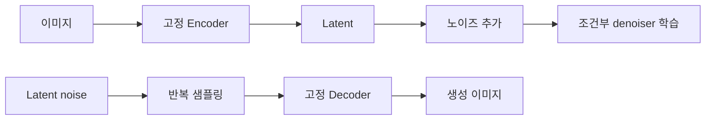

# 16. Latent Diffusion — 압축 공간에서 확산 모델 돌리기

- **논문**: High-Resolution Image Synthesis with Latent Diffusion Models
- **저자 / 발표**: Robin Rombach 외 / arXiv 2021, CVPR 2022
- **약자**: LDM, Latent Diffusion Model
- **한 줄 요약**: 이미지의 압축된 표현에서 diffusion을 수행해 고해상도 생성의 비용을 줄인다.
- **선행 지식**: [VAE](13-vae.md), [DDPM](15-ddpm.md), cross-attention

## 1. 왜 latent에서 생성하나?

Pixel 공간에서 반복 denoising하면 많은 계산이 필요하다. LDM은 perceptual compression과 생성 학습을 분리한다. 압축률이 높을수록 계산은 줄지만 세부 정보 손실 위험은 커진다.

## 2. 두 단계 구조

첫 단계는 이미지 encoder $\mathcal E$와 decoder $\mathcal D$를 학습한다. Perceptual 및 adversarial 목적과 함께 KL 또는 VQ 정규화 설정을 다룬다. 단순한 기본 VAE의 재구성 손실만 사용한다고 설명하면 부족하다.

두 번째 단계에서는 압축기를 고정하고 $z=\mathcal E(x)$ 공간의 diffusion 모델을 학습한다.

## 3. 학습 수식

$$
\mathcal L_{LDM}
=\mathbb E_{\mathcal E(x),y,t,\epsilon}
\left\|\epsilon-
\epsilon_\theta(z_t,t,\tau(y))\right\|_2^2
$$

$y$는 텍스트 등의 조건, $\tau$는 조건 encoder다. Denoiser 내부의 cross-attention으로 조건을 반영한다. 원 논문은 텍스트 외 bounding box, 이미지 기반 조건과 여러 과제도 다룬다.

## 4. 직접 계산하는 압축 예시

설명용으로 512×512×3 이미지를 64×64×4 latent로 바꾼다고 하자. 원소 수는 786,432에서 16,384로 줄어 48배 차이가 난다.

하지만 실행 속도가 정확히 48배 빨라진다고 말할 수 없다. Denoiser의 내부 채널 수, attention, 샘플링 횟수, encoder·decoder 비용이 따로 있기 때문이다. 공간 해상도 축소 배수와 전체 연산량 감소를 구분하는 연습이다.

## 5. 생성 과정

추론에서는 latent noise에서 시작해 조건에 맞는 $z_0$를 생성하고 decoder로 한 번 이미지화한다. 원본 사진을 요구하지 않는 text-to-image와, 입력 사진을 조건으로 쓰는 복원·편집 과제를 나눠 보자.

Stable Diffusion을 이해하는 기초 논문이지만, 모든 제품 버전의 모델·데이터·sampler 구성을 이 한 논문이 정의한 것은 아니다.

## 6. 실험 결과의 핵심

원문은 압축률별 품질·계산 비용과 text-to-image, inpainting, super-resolution 등을 비교한다. §4.1의 압축 절충을 먼저 보면 왜 latent를 도입했는지 이해하기 쉽다.

좋은 생성 모델을 만들기 전에 압축기 자체의 복원 한계를 확인해야 한다. Denoiser가 아무리 좋아도 decoder가 표현하지 못하는 정보를 정확히 복원할 수는 없다.

## 7. 한계와 Physical AI 연결 — 해설

텍스트 조건의 세밀한 관계를 놓치거나 작은 물체가 압축에서 사라질 수 있다. 반복 생성 비용도 남는다.

[Cosmos](../papers/10-cosmos.md)와 [World Simulation](../papers/11-world-simulation.md)을 볼 때 픽셀·비디오 latent·행동 latent를 구별하자. 모두 latent라는 단어를 써도 보존하는 정보와 decoder의 출력이 다르다. 이미지의 perceptual quality와 제어에 필요한 상태 정확도는 다른 요구사항이다.

## 8. 이해 확인

1. 압축기를 먼저 학습하고 고정하면 어떤 계산상의 이점이 있는가?
2. 공간 크기 8배 축소와 전체 원소 수 8배 축소는 같은가?
3. 작은 물체가 압축기에서 사라지면 생성기의 개선만으로 해결될까?

## 원문과 확인 위치

- [논문](https://arxiv.org/abs/2112.10752): §3.1 압축, §3.2 latent diffusion, §3.3 조건, §4 실험.

[전체 목록](README.md) · [용어집](GLOSSARY.md)
