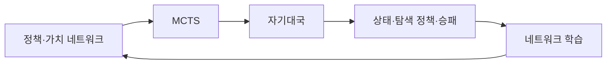

# 20. AlphaZero — 자기대국과 탐색으로 정책 개선하기

- **논문**: Mastering Chess and Shogi by Self-Play with a General Reinforcement Learning Algorithm
- **저자 / 발표**: David Silver 외 / arXiv 2017
- **후속 정식 발표**: A general reinforcement learning algorithm that masters chess, shogi, and Go through self-play / Science 2018
- **범위**: 아래 설명과 비교는 2017 arXiv 버전 기준
- **한 줄 요약**: 정책·가치 네트워크와 MCTS를 결합하고 자기대국 결과로 학습한다.
- **선행 지식**: 정책, 가치함수, 탐색 트리; [DQN](18-dqn.md)

## 1. 무엇이 핵심인가?

사람의 기보를 모방하는 대신 규칙에 따라 자기 자신과 대국해 학습 데이터를 만든다. 신경망은 유망한 수와 승패 전망을 제공하고, 탐색은 그 정보를 이용해 더 나은 행동 분포를 만든다.

“인간 데이터가 없다”와 “사전 지식이 전혀 없다”는 다르다. 게임 규칙, 합법 수, 상태 표현, 시뮬레이터가 주어진다.

## 2. 정책·가치 네트워크

$$
f_\theta(s)=(p,v)
$$

$p$는 행동 prior, $v$는 결과 예측이다. MCTS는 이 예측을 이용해 탐색 자원을 배분한다. 탐색 후 방문 횟수에서 얻은 분포 $\pi$가 학습의 정책 target이 된다.

## 3. 학습 목표

$$
\mathcal L=(z-v)^2-\pi^\top\log p+c\|\theta\|^2
$$

$z$는 최종 게임 결과, $\pi$는 탐색으로 얻은 정책, $c$는 정규화 계수다. 결과 예측 오차와 탐색 행동을 맞히는 손실을 함께 줄인다.

## 4. 직접 만든 예시

네트워크 prior가 수 A에 70%, 수 B에 30%를 줬다고 하자. 탐색이 A 이후의 불리한 반격을 발견하면 방문 분포는 B에 더 많은 비중을 줄 수 있다. 네트워크는 다음 학습에서 이 탐색 결과를 target으로 삼는다.

이 과정에서 탐색 정책이 무조건 완벽해지는 것은 아니다. 탐색 budget, 가치 예측 오류, 아직 방문하지 않은 수에 영향을 받는다. 하지만 현재 네트워크만 바로 사용하는 것보다 개선된 학습 신호를 만들 수 있다는 발상이 중요하다.

## 5. 학습·평가 조건

체스·쇼기·바둑에서 같은 일반 알고리즘을 적용하지만 **게임별로 별도 네트워크를 학습**한다. 한 가중치가 세 게임을 동시에 수행한 결과는 아니다. 2017 보고는 정해진 계산·대국 조건에서 강한 기존 프로그램을 이기는 성과를 제시한다.

원문의 시간 단위 결과를 개인 GPU 한 대의 학습 시간으로 읽으면 안 된다. 하드웨어와 대규모 자기대국 계산 자원이 포함된 실험이다.

## 6. 한계

정확한 규칙과 시뮬레이터가 있는 완전정보 보드게임을 다룬다. 연속 상태, 불완전 관측, 비싼 실제 시행이 있는 로봇 문제로 그대로 옮기기 어렵다. 탐색은 추론 시간에도 계산 비용을 추가한다.

## 7. Physical AI·World Model 연결 — 해설

[Cosmos](../papers/10-cosmos.md) 같은 world model을 읽을 때 “미래를 예측할 수 있으면 탐색에 어떻게 사용할까?”라는 질문으로 연결할 수 있다. 다만 AlphaZero는 환경 전이를 학습한 world model이 아니라 주어진 게임 규칙을 사용한다.

실제 로봇에서 학습된 모델의 예측을 길게 이어 쓰면 오차가 누적될 수 있다. 생성 영상이 자연스럽다는 것과 탐색용 시뮬레이터가 정확하다는 것은 별도 평가가 필요하다.

## 8. 이해 확인

1. 네트워크 정책 $p$와 탐색 정책 $\pi$는 왜 다른가?
2. 사람 기보를 안 쓰더라도 어떤 환경 지식이 필요한가?
3. 학습된 부정확한 dynamics로 탐색하면 어떤 문제가 생기는가?

## 원문과 확인 위치

- [2017 논문](https://arxiv.org/abs/1712.01815): 알고리즘 설명, 게임별 성능 비교, Methods의 네트워크·탐색·학습 설정.

[전체 목록](README.md) · [용어집](GLOSSARY.md)
