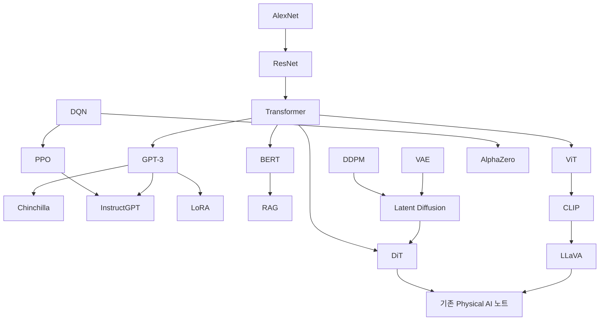

# 대표 AI 논문 스터디 — AI Foundations

딥러닝 기반 현대 AI의 핵심 개념을 공부하기 위한 **대표 논문 20편의 한국어 해설**입니다. 기존 [Physical AI 논문 폴더](../papers/)와 별도로 읽을 수 있고, VLM·VLA·World Model을 이해하는 기초 과정으로도 사용할 수 있습니다.

선정 기준은 인용 순위의 엄밀한 상위 20개가 아니라 **구조·학습 목표·표현·생성·의사결정의 중요한 전환을 설명하는가**입니다. 고전 머신러닝 전체나 2026년 최신 논문을 망라하는 목록은 아닙니다. 2012~2023년의 핵심 딥러닝 계보에 초점을 맞췄습니다.

각 노트에는 문제의식, 구조, 핵심 수식과 기호, 학습 과정, 실험 해석, 한계, 직접 만든 예시, 이해 확인 질문, 원문 링크가 있습니다. “해설”, “사고 실험”, “직접 만든 예시”는 원 논문의 실험 결과와 구분했습니다.

## 빠른 시작

- **AI 전반을 처음 공부한다면**: [용어집](GLOSSARY.md) → AlexNet → ResNet → Transformer.
- **LLM이 궁금하다면**: Transformer → BERT와 GPT-3 비교 → Chinchilla → InstructGPT → LoRA → RAG.
- **VLM·Physical AI가 목적이라면**: Transformer → ViT → CLIP → LLaVA → DDPM → LDM → DiT → 기존 VLA 노트.
- **강화학습이 궁금하다면**: DQN → PPO → AlphaZero → InstructGPT 재독.

번호는 폴더 내 식별·정렬용입니다. 전체가 연대순이거나 모든 앞 번호를 먼저 읽어야 하는 구조는 아닙니다.

## 전체 목록

연도는 최초 공개를 우선하며 학회·저널 발표가 다른 경우 병기했습니다. 난이도는 이 스터디의 학습 안내이며 논문의 객관적인 등급이 아닙니다.

| 번호 | 논문 노트 | 공개 / 발표 | 분야 | 난이도 | 핵심 질문 |
|---|---|---|---|---|---|
| 01 | [AlexNet](01-alexnet.md) | 2012 | 비전 기초 | 입문 | 필터·GPU·대규모 지도학습 |
| 02 | [ResNet](02-resnet.md) | 2015 / CVPR 2016 | 비전 기초 | 입문 | 잔차 연결·깊은 네트워크 |
| 03 | [Transformer](03-transformer.md) | 2017 | 공통 구조 | 중급 | Attention·encoder·decoder |
| 04 | [BERT](04-bert.md) | 2018 / NAACL 2019 | 언어 | 중급 | 양방향 문맥·MLM |
| 05 | [GPT-3](05-gpt3.md) | 2020 | 언어 | 중급 | 다음 토큰 예측·in-context learning |
| 06 | [Chinchilla](06-chinchilla.md) | 2022 | 언어·학습 규모 | 중급 | 계산 예산·모델·데이터의 균형 |
| 07 | [InstructGPT](07-instructgpt.md) | 2022 | 언어·사후학습 | 중급 | SFT·보상 모델·RLHF |
| 08 | [LoRA](08-lora.md) | 2021 / ICLR 2022 | 효율적 적응 | 중급 | 저랭크 업데이트 |
| 09 | [RAG](09-rag.md) | 2020 | 검색·언어 | 중급 | 외부 기억·문서 주변화 |
| 10 | [ViT](10-vit.md) | 2020 / ICLR 2021 | 비전 | 중급 | 패치 토큰·대규모 사전학습 |
| 11 | [CLIP](11-clip.md) | 2021 | 시각–언어 | 중급 | 대조학습·zero-shot 분류 |
| 12 | [LLaVA](12-llava.md) | 2023 | 시각–언어 | 중급 | VLM·시각 지시 미세조정 |
| 13 | [VAE](13-vae.md) | 2013 / ICLR 2014 | 생성 | 심화 | ELBO·잠재변수·재매개화 |
| 14 | [GAN](14-gan.md) | 2014 | 생성 | 중급 | 적대적 학습·분포 |
| 15 | [DDPM](15-ddpm.md) | 2020 | 생성 | 심화 | 노이즈 예측·확산 |
| 16 | [Latent Diffusion](16-latent-diffusion.md) | 2021 / CVPR 2022 | 생성 | 심화 | 잠재공간·조건부 생성 |
| 17 | [DiT](17-dit.md) | 2022 / ICCV 2023 | 생성 | 심화 | Transformer denoiser·adaLN-Zero |
| 18 | [DQN](18-dqn.md) | 2015 | 강화학습 | 중급 | Q-learning·replay·target network |
| 19 | [PPO](19-ppo.md) | 2017 | 강화학습 | 심화 | 정책 gradient·clipping |
| 20 | [AlphaZero](20-alphazero.md) | 2017 / Science 2018 | 강화학습·탐색 | 심화 | 자기대국·MCTS·정책/가치 |

## 개념 연결 지도

화살표는 권장 학습 연결입니다. 모든 간선이 직접적인 인용·구현 계보라는 뜻은 아닙니다.

## 공부 방식: 한 편을 세 번 읽기

1. **첫 번째 — 문제와 입출력**: 수식을 건너뛰고 기존 방법의 문제, 입력, 출력, 정답의 형태를 적습니다.
2. **두 번째 — 구조와 학습**: 어떤 모듈이 고정되고 무엇이 학습되는지, loss가 어떤 값을 높이거나 낮추는지 설명합니다.
3. **세 번째 — 실험과 반례**: 원문의 핵심 표를 보고 데이터·모델·평가 조건을 확인한 뒤, 노트의 이해 질문에 답합니다.

복잡한 식은 기호를 모두 외우기보다 아주 작은 숫자를 넣어 계산해 보세요. 그다음 원문 수식과 본 노트의 축약식을 구분해 읽으면 좋습니다.

## 6주 학습 예시

| 주차 | 읽을 노트 | 남길 결과 |
|---|---|---|
| 1 | 01~03 | CNN·잔차·attention의 정보 흐름을 직접 그리기 |
| 2 | 04~06 | BERT와 GPT의 목표 비교, 계산 예산 문제 풀이 |
| 3 | 07~09 | SFT·RLHF·LoRA·RAG가 각각 무엇을 바꾸는지 설명 |
| 4 | 10~12 | 이미지가 VLM의 텍스트 답변으로 바뀌는 과정 설명 |
| 5 | 13~17 | VAE·GAN·DDPM 비교, latent·DiT 역할 구분 |
| 6 | 18~20 | 가치학습·정책학습·탐색 비교 후 Physical AI 연결 |

주차는 예시입니다. 특히 생성 모델과 강화학습은 확률·미분 배경에 따라 시간을 더 써도 좋습니다.

## 기존 Physical AI 노트와 함께 읽기

아래 연결은 선수 개념 안내입니다. 오른쪽 논문이 왼쪽 알고리즘을 그대로 사용한다는 뜻은 아닙니다.

| 먼저 이해할 개념 | 이어 읽을 기존 노트 | 확인할 질문 |
|---|---|---|
| Transformer·시각 표현 | [RT-1](../papers/01-rt1.md), [RT-2](../papers/02-rt2.md) | 무엇을 토큰으로 만들고 무엇을 예측하는가? |
| VLM·효율적 적응 | [OpenVLA](../papers/04-openvla.md) | 이미지·언어가 행동 출력으로 어떻게 연결되는가? |
| 확산 생성·latent | [π0](../papers/05-pi0.md) | DDPM과 flow matching의 학습 target은 어떻게 다른가? |
| VLM·Transformer denoiser | [GR00T N1](../papers/08-groot-n1.md) | 인지와 행동 생성 사이 어떤 표현이 전달되는가? |
| 생성 모델·탐색 | [Cosmos](../papers/10-cosmos.md), [World Simulation](../papers/11-world-simulation.md) | 미래 영상의 자연스러움과 물리적 정확도를 어떻게 구분하는가? |
| 보상·경험·정책 개선 | [π*0.6](../papers/07-pi06.md) | 어떤 평가 신호를 어떻게 정책 학습에 사용하는가? |

## 서로 헷갈리기 쉬운 개념

| 비교 | 구분할 점 |
|---|---|
| Transformer vs GPT | 공통 구조 계열과 특정 언어 모델 계열 |
| ViT vs CLIP | 이미지 처리 구조와 이미지–텍스트 정렬 학습 |
| CLIP vs LLaVA | 유사도 계산 중심 모델과 텍스트 답변 생성 VLM |
| VLM vs VLA | 이미지·언어 처리와 행동 출력까지 포함하는 모델 |
| Pretraining vs SFT | 넓은 기반 표현 학습과 시범 답변·지시에 대한 미세조정 |
| LoRA vs RAG | 가중치 변화량 학습과 외부 문서 제공 |
| DDPM vs DiT | 확산 모델의 학습·생성 틀과 denoiser 구조 |
| Diffusion vs flow matching | 관계는 있지만 확률 경로·target·sampling 설명을 별도 확인 |
| DQN vs PPO | 행동 가치 추정 중심과 정책 확률 업데이트 중심 |
| AlphaZero vs learned world model | 주어진 게임 규칙을 이용한 탐색과 학습된 환경 예측 |

## 결과를 읽을 때 지킬 기준

- Top-1과 top-5, 개발과 테스트, 단일 모델과 앙상블을 구분합니다.
- FID는 데이터셋·해상도·표본 수·참조 분포·guidance가 같아야 비교가 명확해집니다.
- Zero-shot은 목표 과제에서 추가 학습하지 않는다는 의미이며 학습 데이터 중복이 전혀 없다는 증명이 아닙니다.
- 높은 인간 선호, 사실 정확도, 벤치마크 점수, 로봇 성공률은 서로 다른 지표입니다.
- 새로운 모델 이름보다 **입력, 출력, 학습되는 파라미터, loss, 평가 조건**을 먼저 확인합니다.

## 원문과 작성 범위

논문 전문·그림을 복제하는 대신 직접 작성한 해설과 간단한 도식을 제공합니다. 각 글 끝에 원문과 확인할 절·표를 적었습니다. 최초 공개 연도와 후속 발표를 구분했으며, 특히 DQN은 2015 Nature 버전, LLaVA는 최초 논문, AlphaZero는 2017 arXiv 버전을 기준으로 설명합니다.

이 노트는 논문 전체의 완역이나 재현 실험 보고서가 아닙니다. 결과는 해당 논문이 보고한 실험이며, 수치 예시는 별도로 표시했습니다. 기존 Physical AI 노트의 내용 검증·수정은 이번 폴더의 범위에 포함하지 않았습니다.

[용어집](GLOSSARY.md) · [저장소의 기존 안내](../README.md)
