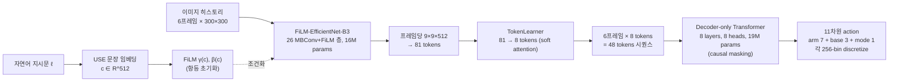

# 01. RT-1: Robotics Transformer for Real-World Control at Scale

- **저자/소속**: Anthony Brohan et al., Google Robotics / Everyday Robots (2022)
- **arXiv**: [2212.06817](https://arxiv.org/abs/2212.06817)
- **한 줄 요약**: 이미지 히스토리 + 자연어 지시를 토큰화해 하나의 Transformer로 로봇 행동(action)을 이산 토큰 시퀀스로 예측하는, "로봇용 GPT"의 원형.

---

## 1. 문제의식 — 이전 연구의 한계

RT-1 이전 로봇 모방학습(imitation learning)은 두 축에서 한계를 보였다.

1. **모델 용량(capacity) 문제**: 로봇 조작 정책은 보통 소규모 CNN + MLP/LSTM 구조였는데, 데이터가 늘어나도 성능이 포화(saturate)되는 경향이 있었다. 즉 "많이 학습시켜도 안 느는" 모델이었다.
2. **이질적 데이터(heterogeneous data) 흡수 문제**: 시뮬레이션 데이터, 다른 로봇(Kuka 등)의 데이터, 다양한 태스크의 데이터를 한꺼번에 섞으면 오히려 단일 태스크 성능이 떨어지는(negative transfer) 현상이 흔했다.

RT-1의 핵심 주장: **"용량이 크면서도 실시간 제어(control loop)에 쓸 만큼 빠른 아키텍처"** 를 만들면, 이질적 데이터를 섞어도 성능이 떨어지지 않고 오히려 일반화가 좋아진다. 이건 NLP에서 Transformer가 스케일이 커질수록 데이터를 더 잘 흡수하던 현상을 로봇 조작에 그대로 옮기려는 시도다.

## 2. 입출력 정의

- **입력**: 최근 6프레임의 RGB 이미지 히스토리 $\{I_1, ..., I_6\}$ (300×300) + 자연어 지시 $\ell$ (예: "pick up the coke can")
- **출력**: 11차원의 이산화된 action vector (한 timestep당)
  - Arm: $(x, y, z, roll, pitch, yaw, gripper\_opening)$ — 7차원
  - Base(모바일 베이스 이동): $(x, y, yaw)$ — 3차원
  - Mode switch: {arm 제어, base 제어, episode 종료} — 1차원 (3-way)
- 각 차원은 **256개 bin으로 균일 이산화(uniform discretization)** 된다:

$$
a_{bin} = \text{round}\left(\frac{\text{clip}(a, a_{min}, a_{max}) - a_{min}}{a_{max} - a_{min}} \times 255\right), \quad a_{bin} \in \{0, ..., 255\}
$$

- 제어 주기: **3 Hz** (실제 로봇 팔에서 이 정도 속도로 다음 action을 뽑아낼 수 있어야 실사용 가능하다는 하드웨어 제약이 아키텍처 설계 전체를 지배함)

## 3. 아키텍처

전체 파이프라인: `이미지 히스토리 + 지시문 → FiLM-EfficientNet (비전-언어 토큰화) → TokenLearner (토큰 압축) → Decoder-only Transformer → 이산 action 토큰`

> 아래 다이어그램은 논문 Figure를 그대로 옮긴 것이 아니라, 본문에 설명된 데이터 흐름을 이해한 뒤 직접 재구성한 것입니다.

**읽는 법**: 지시문은 이미지 인코더 내부에 FiLM으로 스며들어("어떤 이미지 영역이 지시와 관련 있는지" 조기 필터링) 들어가고, 이미지는 81개 토큰으로 쪼개진 뒤 TokenLearner가 8개로 압축한다. 6프레임 × 8토큰 = 48개 토큰만 Transformer에 들어가기 때문에 3Hz 실시간 추론이 가능해진다.

### 3.1 언어 조건화(conditioning) — FiLM

자연어 지시 $\ell$을 **Universal Sentence Encoder(USE)** 로 임베딩해 고정 벡터 $c \in \mathbb{R}^{512}$ 를 얻는다. 이 $c$ 를 이미지 인코더 내부에 **FiLM(Feature-wise Linear Modulation)** 층으로 주입한다.

FiLM은 CNN 중간 피처맵 $x$ 에 대해 채널별 affine 변환을 가한다:

$$
\text{FiLM}(x) = \gamma(c) \odot x + \beta(c)
$$

여기서 $\gamma(c), \beta(c)$ 는 $c$ 로부터 작은 MLP(또는 1x1 conv)로 생성되는 채널별 스케일·시프트 벡터다. **중요한 구현 디테일**: $\gamma, \beta$ 를 만드는 layer는 **항등변환으로 초기화**된다 ($\gamma \approx 1, \beta \approx 0$). 이렇게 하면 사전학습된 ImageNet EfficientNet 가중치를 학습 초반에 훼손하지 않고, 학습이 진행되면서 점진적으로 "언어 지시와 관련된 이미지 영역"에 집중하도록 유도된다.

### 3.2 비전 인코더 — FiLM-EfficientNet-B3

- ImageNet 사전학습 **EfficientNet-B3** 백본에 FiLM 층을 끼워넣은 구조 (26개의 MBConv 블록 + FiLM 층들)
- 파라미터 수: **약 16M**
- 각 프레임을 $9 \times 9 \times 512$ 공간 피처맵으로 인코딩 → **flatten하여 81개 토큰**으로 변환 (각 토큰은 512차원)
- 6프레임 히스토리이므로 원래는 $81 \times 6 = 486$ 개 토큰이 발생 — 이대로 Transformer에 넣으면 시퀀스가 너무 길어져서 3Hz 추론이 불가능해진다. 그래서 아래 TokenLearner가 필요하다.

### 3.3 TokenLearner — 토큰 압축

TokenLearner는 학습 가능한 **element-wise soft attention** 모듈로, N개의 토큰을 훨씬 적은 K개의 토큰으로 압축한다. 개념적으로:

$$
\alpha_i = \text{softmax}(\text{MLP}_i(X)) \in \mathbb{R}^{N}, \quad z_i = \sum_{n=1}^{N} \alpha_{i,n} \cdot X_n
$$

를 $i = 1, ..., K$ 에 대해 반복해 $K$개의 압축 토큰 $\{z_1, ..., z_K\}$ 를 얻는다. RT-1에서는:

- 프레임당 **81 → 8 토큰**으로 압축
- 6프레임이므로 최종 시퀀스 길이 = $8 \times 6 = 48$ 토큰

이 압축이 RT-1 실시간성의 핵심 트릭이다 — Transformer에 들어가는 시퀀스 길이를 10분의 1로 줄여서 추론 속도를 확보한다.

### 3.4 Decoder-only Transformer

- 48개의 비전-언어 토큰을 입력받는 **디코더 전용(decoder-only) Transformer**
- 8 self-attention layers, 8 heads, key-value 차원 512, feed-forward 차원 512
- 파라미터 수: **약 19M** (전체 모델 = 16M(비전) + 19M(Transformer) ≈ **35M**, 당시 로봇 정책치고는 큰 편)
- **Causal masking**: action 토큰은 자기 자신 이전의 action 토큰과 모든 이미지 토큰만 볼 수 있음 (미래 action이나 미래 프레임을 못 보게 마스킹) → autoregressive하게 11개 action 차원을 순차적으로 예측

### 3.5 학습 목적함수

각 action 차원의 256-way 분류 문제로 취급해 **categorical cross-entropy**로 학습:

$$
\mathcal{L} = -\sum_{t=1}^{T} \sum_{d=1}^{11} \log p_\theta\left(a_{t,d}^{bin} \mid I_{\le t}, \ell, a_{t, j \lt d}^{bin}\right)
$$

- $T$: 에피소드 내 timestep 수, $d$: 11개 action 차원 인덱스
- teacher-forcing으로 학습 (실제 시연 데이터의 ground-truth action bin을 이전 컨텍스트로 사용)
- optimizer: Adam 계열, 배치 정규화 없이 학습 안정성 확보를 위해 사전학습 백본 사용이 중요했다고 보고됨

## 4. 데이터

- **130k개 에피소드**, 700개 이상의 태스크, 13대의 실물 로봇(Everyday Robots)을 이용해 **17개월간** 수집
- 실제 부엌 환경("Kitchen1", "Kitchen2" 등 여러 실제 사무실 주방)에서 원격조작(teleoperation)으로 시연 수집
- **이질적 데이터 co-training 실험**: RT-1은 자체 데이터 외에 (1) 시뮬레이션 데이터, (2) 다른 로봇(Kuka)의 bin-picking 데이터를 섞어 학습해도 원래 태스크 성능이 떨어지지 않고, 오히려 새로운 태스크/객체에 대한 일반화가 좋아짐을 실험적으로 보임 — 이게 "이질적 데이터 흡수 문제"에 대한 실증적 답.

## 5. 실험 결과

- **학습된 태스크(seen)**: 200개 태스크 평균 **97% 성공률**
- **미학습 태스크(unseen instructions)**: 76% — 학습 시 못 본 지시문 조합에도 어느 정도 일반화
- **새로운 객체/환경/배경/방해물(distractor)**: 기존 baseline(Gato, BC-Z, BC-Z XL 등) 대비 큰 폭으로 우수
- **장기 태스크(long-horizon, SayCan과 결합)**: RT-1을 SayCan의 저수준 정책으로 사용했을 때, 이전 정책 대비 실행 성공률이 크게 향상 (RT-1이 "지시를 실제로 잘 수행하는" 저수준 실행기 역할을 함)
- Ablation에서 확인된 것: (a) FiLM 조건화 제거 시 성능 하락, (b) TokenLearner 제거(전체 토큰 사용) 시 속도는 느려지지만 성능은 비슷 — 즉 TokenLearner는 "속도-성능 트레이드오프에서 거의 손해 없이 속도를 얻는" 장치, (c) 사전학습된 EfficientNet 대신 처음부터 학습 시 성능 크게 하락 → 비전 사전학습의 중요성.

## 6. 한계 및 다음 논문과의 연결고리

- **행동 표현이 여전히 discrete bin**: 256개 bin으로 각 차원을 자르는 방식은 정밀한 연속 제어(특히 dexterous manipulation)에서 정보 손실이 생김 → 이후 π0의 **flow matching** 기반 연속 행동 생성으로 이어지는 문제의식.
- **언어 이해력이 USE 임베딩 수준에 묶임**: RT-1의 언어 이해는 학습된 지시문 분포를 크게 못 벗어남. 웹 규모 지식은 전혀 활용 못함 → RT-2가 대형 VLM(PaLI-X/PaLM-E)을 통째로 백본으로 가져와 웹 지식을 전이하는 방향으로 발전.
- **단일 embodiment 중심**: RT-1은 사실상 Everyday Robots 팔 하나에 최적화. 여러 embodiment를 아우르는 범용 정책은 Octo, OpenVLA 이후 본격화.
- 3Hz라는 제어 주기 자체가 낮아, 빠른 dexterous task(옷 개기 등)에는 부적합 — 이후 π0가 50Hz까지 끌어올림.

**다음 논문**: [02. RT-2](02-rt2.md) — RT-1의 비전-언어 백본을 대형 사전학습 VLM으로 교체하면 무슨 일이 일어나는가?
