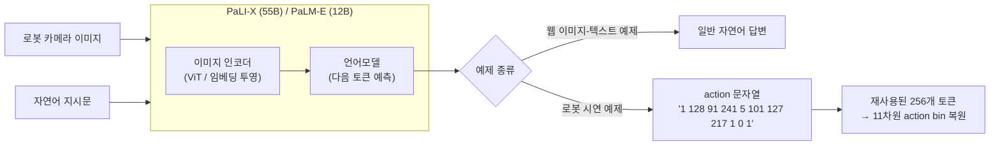
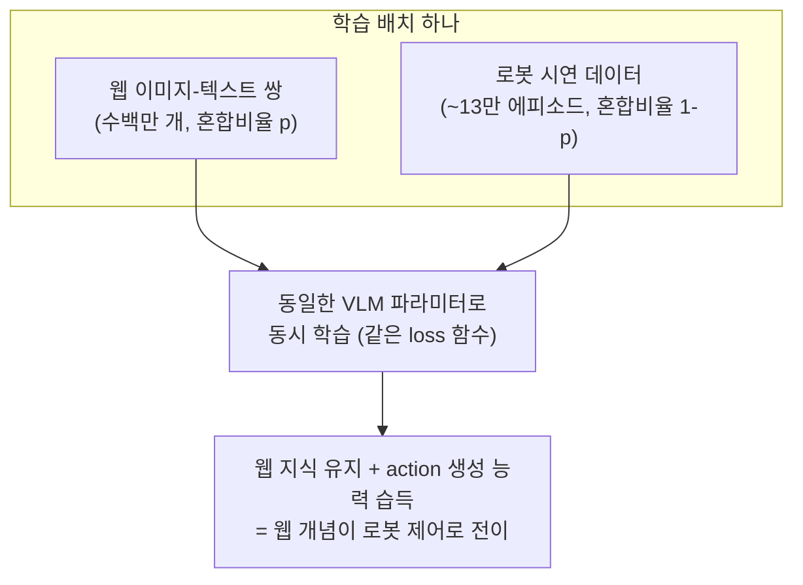

# 02. RT-2: Vision-Language-Action Models Transfer Web Knowledge to Robotic Control

- **저자/소속**: Anthony Brohan, Brianna Zitkovich et al., Google DeepMind (2023.07)
- **arXiv**: [2307.15818](https://arxiv.org/abs/2307.15818)
- **한 줄 요약**: "행동(action)을 그냥 또 하나의 언어로 취급"해서, 웹 규모로 사전학습된 대형 VLM을 로봇 데이터로 co-fine-tuning하면 인터넷 지식이 로봇 제어로 전이(transfer)된다는 것을 처음 실증.

이전 논문: [01. RT-1](01-rt1.md)

---

## 1. 문제의식 — RT-1의 한계에서 출발

RT-1(35M 파라미터, ImageNet 사전학습 EfficientNet + 소형 Transformer)은 실시간성은 확보했지만, **비전-언어 이해력 자체가 로봇 데이터 규모에 갇혀 있었다.** RT-1은 학습 데이터에 없던 개념(예: "sum of two plus one" 같은 산술 표현, 브랜드 로고, 국기 등)을 전혀 이해하지 못한다. 반면 인터넷에는 이미 그런 지식을 담은 VLM(PaLI-X, PaLM-E)이 존재한다.

**핵심 질문**: 로봇 조작 정책의 비전-언어 백본을 처음부터 학습시키지 말고, 이미 웹 규모 데이터로 사전학습된 대형 VLM을 통째로 가져와 로봇 데이터로 fine-tuning하면 어떻게 될까? 이때 "웹 지식"이 로봇 제어로 전이되는가?

## 2. 핵심 아이디어 — Action을 텍스트 토큰으로 재정의

RT-2의 트릭은 새로운 아키텍처를 설계하는 게 아니라, **기존 VLM의 입출력 인터페이스를 손대지 않고 action을 텍스트 문자열로 표현**하는 것이다.

RT-1과 동일하게 action은 11차원, 각 차원 256-bin으로 이산화한다. 하지만 이 discrete bin index를 별도의 action head로 디코딩하지 않고, **VLM의 기존 텍스트 vocabulary 안의 정수 토큰(예: "1", "128", "91"...)에 그대로 매핑**한다. 즉 하나의 action은 다음과 같은 문자열이 된다:

```
"1 128 91 241 5 101 127 217 1 0 1"
```

(→ 11개 숫자 토큰, terminate 토큰까지 포함해 문자열로 표현)

**구현 디테일**: PaLI-X/PaLM-E는 이미 자체 tokenizer로 정수를 표현할 수 있지만, 자연어 텍스트에서는 큰 숫자가 잘 안 쓰여서 tokenizer의 어휘 낭비가 있다. RT-2는 **VLM vocabulary에서 가장 적게 쓰이는 256개의 토큰을 action bin 표현용으로 재사용(overwrite)** 한다. 이렇게 하면 새 토큰을 추가하거나 출력층 구조를 바꿀 필요 없이, "다음 토큰 예측"이라는 VLM의 원래 학습 목적함수를 그대로 쓸 수 있다.

수식으로는 RT-1과 마찬가지로 각 action 토큰에 대한 autoregressive cross-entropy:

$$
\mathcal{L} = -\sum_{d=1}^{D} \log p_\theta\left(y_d \mid I, \ell, y_{j \lt d}\right)
$$

인데, 여기서 $y_d$ 는 "action bin을 나타내는 언어 토큰"이며 $p_\theta$ 는 **VLM 전체(수십억 파라미터)** 가 만드는 분포라는 게 RT-1과의 결정적 차이다.

## 3. 아키텍처 — 두 개의 백본으로 실험

RT-2는 서로 다른 두 VLM을 각각 fine-tuning해 비교한다.

| 모델 | 백본 | 파라미터 | 방식 |
|---|---|---|---|
| **RT-2-PaLI-X** | PaLI-X | **55B** | 이미지 인코더(ViT) + 인코더-디코더 언어모델. 이미지 패치 토큰 + 텍스트 토큰을 함께 입력 |
| **RT-2-PaLM-E** | PaLM-E | **12B** | 이미지 임베딩을 언어모델의 토큰 임베딩 공간에 직접 투영(project)해 "멀티모달 문장"의 일부로 넣는 구조 |

두 경우 모두 **아키텍처 자체는 원래 VLM 그대로**이고, 학습 데이터와 출력 vocabulary 해석 방식만 바뀐다. 이 점이 RT-1(전용 아키텍처 설계)과 RT-2(기존 VLM 재활용)의 철학적 차이다.

> 아래 다이어그램은 논문 Figure를 그대로 옮긴 게 아니라, 본문 설명을 바탕으로 직접 재구성한 것입니다.



**핵심 포인트**: 출력층이나 아키텍처를 바꾸지 않고, vocabulary 안에서 안 쓰던 256개 토큰의 "의미"만 action bin으로 재정의했다. 그래서 같은 모델이 입력 예제 종류에 따라 자연어 답변과 action 문자열을 둘 다 생성할 수 있다.

**추론 시 제약**: 로봇 제어 시에는 vocabulary 전체가 아니라 **action bin에 해당하는 256개 토큰 중에서만 다음 토큰을 디코딩**하도록 강제한다 (constrained decoding). 그렇지 않으면 모델이 일반 텍스트를 생성해버릴 수 있기 때문.

**추론 인프라**: 55B/12B급 모델은 로봇 온보드에서 못 돌리므로, **멀티-TPU 클라우드 서비스에 모델을 올리고 로봇이 네트워크로 질의**하는 방식으로 실행. 이 때문에 제어 주기가 RT-1의 3Hz보다 낮은 **1~3Hz**대로 떨어지는데, 논문은 action chunking(한 번에 여러 스텝 예측) 등으로 이 지연을 일부 상쇄한다.

## 4. 학습 방법 — Co-Fine-Tuning

RT-2 학습의 핵심은 파인튜닝 방식이다. 두 가지 대안을 비교한다:

1. **단순 fine-tuning**: 사전학습된 VLM을 로봇 데이터(RT-1과 동일한 ~13만 에피소드 규모)에만 fine-tuning
2. **Co-fine-tuning (채택)**: 로봇 시연 데이터 + 원래 VLM 사전학습에 쓰인 **웹 규모 vision-language 데이터(수백만 이미지-텍스트 쌍)** 를 **하나의 배치 안에서 함께** 학습

Co-fine-tuning이 중요한 이유는 **catastrophic forgetting 방지**다. 로봇 데이터만으로 fine-tuning하면 모델이 원래 갖고 있던 웹 지식(사물 이름, 개념, 추론 능력)을 빠르게 잊어버린다. 웹 데이터를 계속 섞어주면 사전학습된 표현을 유지하면서 로봇 행동 생성 능력만 "추가"하는 효과가 난다.



단순 fine-tuning(로봇 데이터만 사용)과 비교했을 때, co-fine-tuning 쪽이 미학습 시나리오·emergent 능력 평가에서 일관되게 더 높은 성능을 보였다는 게 논문의 ablation 결과다.

- 배치 구성: 로봇 액션 예제와 웹 VQA/캡셔닝 예제를 **혼합 비율(mixing ratio)** 로 함께 샘플링 (논문은 이 비율을 튜닝 대상으로 명시)
- Co-fine-tuning된 모델은 웹 데이터 예제에서는 여전히 텍스트로 답하고, 로봇 이미지+지시 예제에서는 action 토큰 문자열로 답하도록 학습됨 — **같은 모델이 태스크에 따라 출력 "모드"를 전환**하는 셈

## 5. 실험 결과

**표준 태스크 (6,000회 이상의 실제 로봇 trial로 평가)**

- 학습 태스크(seen) 성능: RT-1과 대등
- **미학습(unseen) 객체/배경/환경**: RT-2가 RT-1 대비 크게 우수. RT-2-PaLI-X-55B는 easy unseen 70% / hard unseen 62%, RT-2-PaLM-E-12B는 easy 84% / hard 76% — 반면 RT-1은 이 범주에서 훨씬 낮은 성능
- **전체 미학습 시나리오 평균**: RT-1의 32%에서 RT-2의 **62%**로 향상

**Emergent evaluation (로봇 학습 데이터에 전혀 없던 능력 테스트)** — 세 범주로 나눠 평가:

1. **Symbol understanding**: 브랜드 로고, 국기, 캐릭터 등 기호적 표현을 이해하고 대응하는 물체를 조작 (예: "레드불 캔을 태즈메이니아 깃발 위에 놓아라")
2. **Reasoning**: "2 더하기 1의 합이 적힌 종이 위에 바나나를 놓아라" 같은 산술/논리 추론이 필요한 지시 수행, "못을 박는 데 쓸 만한 물건을 집어라"(돌을 집음) 같은 도구 추론
3. **Human recognition**: 이미지 속 사람이나 그 행동을 인식해 반응

RT-1이나 VC-1 같은 baseline은 이런 카테고리에서 근본적으로 학습 데이터에 없는 개념이라 거의 수행 불가능한 반면, RT-2는 유의미한 성공률을 보임 — **웹 사전학습에서 얻은 지식이 로봇 행동으로 전이된다는 직접적 증거**.

**Chain-of-thought 변형**: RT-2에 "먼저 자연어로 짧은 계획(plan)을 생성한 뒤 action을 생성"하도록 fine-tuning하면, "졸린 사람에게 어떤 음료가 좋을지" 같은 다단계 semantic reasoning이 필요한 지시도 수행 가능해짐을 보임.

## 6. 한계 및 다음 논문과의 연결고리

- **폐쇄적(closed) 대형 모델 의존**: PaLI-X, PaLM-E는 비공개 모델이라 커뮤니티가 재현·확장하기 어려움. → **OpenVLA**가 완전 오픈소스 VLA를 만드는 동기가 됨.
- **클라우드 추론 필요**: 55B/12B 모델을 로봇 온보드에서 실행 불가 → 지연시간, 네트워크 의존성 문제. 실제 배포 가능한 크기의 모델이 필요.
- **여전히 discrete action bin**: RT-1과 동일한 한계 — 정밀한 연속 제어에 부적합. 이 문제는 여전히 미해결.
- **단일 로봇 embodiment**: RT-2도 여전히 하나의 mobile manipulator에 국한 — 여러 로봇 형태를 아우르는 범용 정책은 다음 단계(Open X-Embodiment/RT-X, Octo)의 과제.

**다음 논문**: [03. Octo](03-octo.md) — 93M의 훨씬 작은 오픈소스 모델로 800K개의 이질적 데모(OpenX-Embodiment)를 학습해 RT-2급 일반화를 재현하려는 시도.
