# 03. Octo: An Open-Source Generalist Robot Policy

- **저자/소속**: Octo Model Team (UC Berkeley, Stanford, CMU, Google DeepMind 등 컨소시엄), 2024.05
- **arXiv**: [2405.12213](https://arxiv.org/abs/2405.12213)
- **한 줄 요약**: RT-2의 10분의 1도 안 되는 93M 파라미터로, **모듈형(modular) Transformer + Diffusion action head** 구조를 통해 여러 로봇 embodiment를 아우르는 오픈소스 범용 정책을 만들고, 새 로봇에 빠르게 fine-tuning 가능하게 함.

이전 논문: [02. RT-2](02-rt2.md)

---

## 1. 문제의식

RT-2는 웹 지식 전이를 증명했지만 두 가지 실용적 문제가 남았다.

1. **재현 불가능성**: PaLI-X(55B), PaLM-E(12B)는 비공개 모델. 커뮤니티가 이 결과를 검증하거나 확장할 수 없다.
2. **경직된 입출력 구조**: RT-1/RT-2는 특정 이미지 개수, 특정 action 차원(11차원)에 고정되어 있어서, 다른 카메라 구성이나 다른 관절 수를 가진 로봇에 적용하려면 아키텍처를 다시 설계해야 한다.

Octo의 목표: **완전히 오픈소스**이면서, **다양한 로봇의 관측·행동 공간에 유연하게 대응**할 수 있는 범용 정책. "하나의 사전학습된 백본을 새로운 embodiment에 few-shot으로 fine-tuning"하는 시나리오를 정면으로 겨냥한다.

## 2. 아키텍처 — 모듈형 3단 구조

Octo는 **(1) 입력 토크나이저, (2) Transformer 백본, (3) readout head** 세 부분을 분리해, 각 부분을 독립적으로 교체/추가할 수 있게 설계했다.

### 2.1 토크나이저

- **언어 지시문**: 사전학습된 T5 인코더로 토큰화 (RT-2처럼 통째로 fine-tuning하는 게 아니라 언어 이해는 고정된 사전학습 인코더에 맡김)
- **이미지 관측**: 무거운 사전학습 비전 백본 대신 **얕은 CNN 스택**으로 인코딩 — 여러 카메라 뷰를 각각 별도 토큰 그룹으로 넣을 수 있음
- **목표 이미지(goal image)**: 언어 대신 "이 이미지 상태에 도달하라"는 형태의 목표 조건화도 지원 (task-agnostic 조건화)

### 2.2 Transformer 백본 — Block-wise Masked Attention

Octo의 핵심 트릭은 attention mask 설계다. 표준 causal transformer는 시퀀스 순서대로만 마스킹하지만, Octo는 **토큰 종류(task vs. observation)와 타임스텝을 모두 고려한 블록 단위 마스크**를 쓴다:

- **Task 토큰**(언어/목표 이미지): 항상 전체 시퀀스에서 참조 가능 (모든 observation 토큰이 여기 attend)
- **Observation 토큰**: 같은 타임스텝 또는 그 이전 타임스텝의 observation 토큰에만 causal하게 attend (미래 관측 참조 불가)
- **존재하지 않는 토큰**(예: 언어 지시 없이 목표 이미지만 준 경우): 자동으로 마스킹되어 무시됨

이 설계 덕분에 **입력 modality 조합을 학습 후에도 유연하게 바꿀 수 있다** — 카메라를 추가/제거하거나 언어 대신 목표 이미지를 쓰는 식의 변경이 아키텍처 재설계 없이 가능.

### 2.3 Readout 토큰과 Diffusion Action Head

Transformer의 최종 출력을 바로 action으로 매핑하지 않고, **학습 가능한 "readout 토큰"** (다른 토큰들의 정보를 압축해서 담는 특수 벡터, BERT의 [CLS] 토큰과 비슷한 역할이지만 여러 개 사용)을 경유한다. Readout 토큰의 최종 임베딩 $z$ 가 action head의 조건(condition)이 된다.

Action head는 **조건부 Denoising Diffusion (DDPM)** 으로 구현되어, action bin 이산화 없이 **연속값 action chunk**(여러 연속 타임스텝의 action 묶음)를 생성한다.

**Diffusion 학습 (forward process)**: 실제 action chunk $a^0$ 에 $K$ 단계에 걸쳐 점진적으로 가우시안 노이즈를 추가:

$$
q(a^k \mid a^0) = \mathcal{N}\left(\sqrt{\bar\alpha_k}\, a^0,\; (1-\bar\alpha_k) I\right), \quad k = 1, ..., K
$$

**노이즈 예측 네트워크 학습**: readout 임베딩 $z$ 로 조건화된 작은 MLP $\epsilon_\theta$ 가 각 노이즈 단계에서 실제 노이즈를 예측하도록 학습:

$$
\mathcal{L}_{\text{diffusion}} = \mathbb{E}_{a^0, \epsilon, k}\left[\left\| \epsilon - \epsilon_\theta(a^k, k, z) \right\|^2\right]
$$

**추론(reverse process)**: 가우시안 노이즈 $a^K \sim \mathcal{N}(0, I)$ 에서 시작해 $K$ 단계를 거꾸로 밟으며 점진적으로 노이즈를 제거해 최종 action chunk $a^0$ 를 복원.

이 방식이 RT-1/RT-2의 discrete bin 방식보다 유리한 점: (1) **연속 공간을 직접 모델링**해 이산화로 인한 정보 손실이 없고, (2) diffusion 자체가 multi-modal 분포(하나의 상태에서 여러 그럴듯한 행동이 가능한 경우)를 자연스럽게 표현할 수 있다.

## 3. 모델 규모 및 학습 데이터

- **Octo-Small**: 27M 파라미터, **Octo-Base**: 93M 파라미터 (RT-2의 55B와 비교하면 600배 이상 작음)
- **학습 데이터**: Open X-Embodiment(OXE) 데이터셋에서 큐레이션한 **약 80만(800K) 에피소드**, 25개 이상의 서로 다른 로봇 embodiment 포함
- 이질적 로봇들의 서로 다른 관측/행동 공간을 앞서 설명한 모듈형 토크나이저 구조로 하나의 학습 파이프라인에 통합

## 4. 실험 결과

- **RT-1-X(35M) 대비**: 언어 조건화 태스크에서 WidowX, UR5, RT-1 플랫폼 평균 **29% 높은 성공률**
- **RT-2-X(55B) 대비**: 파라미터가 600배 이상 적음에도 테스트 태스크에서 **대등한 성능**
- **목표 이미지 조건화 vs 언어 조건화**: WidowX 태스크에서 목표 이미지 조건화가 언어 조건화보다 평균 25% 높은 성능 — 목표 이미지가 더 명확한 조건 신호이기 때문
- **Fine-tuning 성능**: 6개의 새로운 평가 세팅(새 로봇/새 카메라 구성 등)에 fine-tuning했을 때, 다음으로 좋은 baseline 대비 평균 **52% 우수**
- **Ablation**: (a) 비전 인코더로 ViT를 쓸 때, (b) action head로 diffusion을 쓸 때, (c) 학습 데이터 믹스를 넓게(다양한 embodiment) 가져갈 때 각각 최고 성능 — 세 가지가 함께 작동해야 최선의 결과

## 5. 한계 및 다음 논문과의 연결고리

- **여전히 언어 이해력은 사전학습 T5 인코더 수준**: RT-2처럼 대형 VLM을 통째로 쓰지 않기 때문에, RT-2가 보여준 것 같은 "웹 지식 전이"에 의한 emergent reasoning은 Octo에는 없음. 즉 Octo는 "작고 유연한 범용성"을, RT-2는 "크고 지능적인 일반화"를 각각 추구한 셈 — 서로 보완적인 방향.
- **Diffusion 추론 비용**: DDPM은 여러 denoising step을 거쳐야 하므로 action head 자체의 추론 속도가 discrete bin 방식보다 느릴 수 있음 (chunk 단위로 미리 여러 스텝을 예측해 상쇄).
- **비전-언어 파운데이션 모델의 규모를 그대로 못 씀**: 다음 단계는 "Octo처럼 유연하면서도 RT-2처럼 대형 VLM의 지능을 갖는" 모델 — **OpenVLA**가 오픈소스 7B VLM(Prismatic)을 기반으로 이 지점을 공략.

**다음 논문**: [04. OpenVLA](04-openvla.md) — 완전 오픈소스 7B급 VLA로 RT-2 규모의 웹 지식 전이와 Octo 수준의 재현 가능성을 동시에 노리는 시도.
