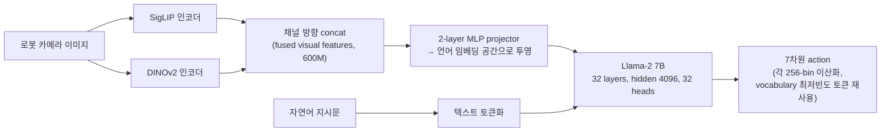

# 04. OpenVLA: An Open-Source Vision-Language-Action Model

- **저자/소속**: Moo Jin Kim, Karl Pertsch et al., Stanford / UC Berkeley / Toyota Research Institute 등, 2024.06
- **arXiv**: [2406.09246](https://arxiv.org/abs/2406.09246)
- **한 줄 요약**: RT-2급 웹 지식 전이 + Octo급 완전 오픈소스/재현성을 동시에 노린, **7B 파라미터 오픈소스 VLA**. 지금도 VLA 연구의 사실상 표준 baseline.

이전 논문: [03. Octo](03-octo.md)

---

## 1. 문제의식

RT-2(55B/12B, 비공개)와 Octo(93M, 오픈소스지만 대형 VLM의 웹 지식은 없음) 사이의 간극을 메우는 것이 목표다.

- RT-2는 웹 지식 전이 효과를 증명했지만 **비공개**라 커뮤니티가 검증·확장 불가능
- Octo는 오픈소스지만 규모가 작아 **대형 VLM 수준의 emergent 능력은 없음**

OpenVLA의 목표: **완전히 공개된 7B급 VLM**을 백본으로 써서 (1) 재현 가능하고 (2) 웹 지식 전이 효과도 어느 정도 누리며 (3) 커뮤니티가 자기 로봇에 맞게 fine-tuning할 수 있는 VLA를 만드는 것.

## 2. 아키텍처 — Prismatic VLM 기반

OpenVLA는 처음부터 설계하지 않고, 기존 오픈소스 VLM인 **Prismatic-7B**를 그대로 백본으로 채택한다.

### 2.1 비전 인코더 — DINOv2 + SigLIP 융합

한 종류의 비전 인코더 대신 **두 개를 나란히 붙여 쓴다**:

- **SigLIP**: 언어-이미지 대조학습(contrastive)으로 사전학습, 의미(semantic) 정보에 강함
- **DINOv2**: 자기지도학습(self-supervised)으로 사전학습, 공간적/기하학적 디테일(경계, 깊이 단서 등)에 강함

동일한 이미지 패치를 두 인코더에 각각 통과시킨 뒤 **채널 방향으로 concat**해 하나의 "융합 피처"(총 600M 파라미터 규모)를 만든다. 이 아이디어는 "의미 이해"와 "정밀한 공간 지각"이 로봇 조작에 둘 다 필요하다는 관찰에서 나왔다 — 순수 언어-이미지 대조학습 인코더(CLIP류)만 쓰면 공간 정밀도가 부족해 조작 정밀도가 떨어지는 경향이 보고되어 있다.

융합된 시각 피처는 **2-layer MLP projector**를 통해 언어모델의 토큰 임베딩 공간으로 투영되어, 텍스트 토큰과 나란히 Llama-2에 입력된다.

### 2.2 언어모델 백본 — Llama-2 7B

- 32개 Transformer layer, hidden dim 4096, 32 attention heads
- 이미지 토큰(투영된 시각 피처)과 텍스트 토큰(지시문)을 하나의 시퀀스로 이어붙여 입력
- RT-2와 마찬가지로 **action을 텍스트 토큰처럼 다룸**: robot action(팔의 경우 7차원: x,y,z,roll,pitch,yaw,gripper)을 [-1, 1]로 정규화한 뒤 **256-bin으로 균일 이산화**하고, Llama-2 tokenizer의 vocabulary 중 **가장 적게 쓰이는 256개 토큰을 재사용**해 action bin을 표현 (RT-2와 동일한 트릭)

### 2.3 학습 데이터와 방식

- **Open X-Embodiment**에서 큐레이션한 **약 97만(970K)개의 실제 로봇 시연**, 70개 이상 도메인/embodiment
- Prismatic-7B의 사전학습 가중치에서 시작해 로봇 데이터로 **전체 파라미터 fine-tuning** (RT-2식 co-fine-tuning과 달리, OpenVLA 학습 자체는 로봇 데이터 위주 — 대신 백본이 이미 웹 규모로 사전학습되어 있다는 점에서 지식은 이미 내재)
- **LoRA 기반 효율적 fine-tuning 지원**: 새로운 로봇/태스크에 맞게 fine-tuning할 때 전체 7B를 업데이트하지 않고 LoRA adapter만 학습 → **A100 GPU 1장으로 10~15시간** 내에 새로운 도메인 적응 가능. 이 실용성이 OpenVLA가 커뮤니티 표준 baseline이 된 핵심 이유 중 하나.

## 3. 실험 결과

- **RT-2-X(55B) 대비**: WidowX·Google Robot embodiment의 29개 평가 태스크 평균 성공률에서 **절대 수치 16.5%p 우수** — 7B 모델이 55B 모델을 능가
- **BridgeData V2 벤치마크**: 대부분의 태스크에서 최고 성능, generalist policy 중 가장 높은 종합 성공률. RT-1-X와 Octo는 일반화 태스크에서 어려움을 겪는 반면 OpenVLA는 안정적
- **Octo 대비**: 파라미터가 70배 이상 크고 추론 시 메모리 사용량도 훨씬 많지만, 평가 전반에서 확실히 우수한 성능
- **완전 오픈소스 공개**: 모델 가중치, 학습 코드, 데이터 파이프라인을 모두 공개 — 이후 수많은 VLA 연구(OpenVLA-OFT, SpatialVLA, ReVLA 등)의 출발점이 됨

## 4. 한계 및 다음 논문과의 연결고리

- **여전히 discrete action bin + autoregressive 생성**: RT-1/RT-2와 마찬가지로 11(혹은 7)개 action 차원을 토큰 하나씩 순차 예측 — 정밀 dexterous manipulation에는 여전히 한계, 추론 속도도 diffusion/flow 방식보다 느림 (autoregressive decoding 특성상)
- **저주파 제어**: OpenVLA도 클수록 느려지는 문제를 안고 있어 실시간 고주파 제어(50Hz급)에는 부적합
- **단일 시점(single-step) action만 예측**: Octo처럼 action chunk(여러 스텝 묶음)를 한 번에 생성하지 않음 → 후속 연구(OpenVLA-OFT 등)에서 개선

이 지점에서 두 갈래로 후속 연구가 갈린다: **"이산화 대신 연속 행동을 직접 생성하자"** (→ π0의 flow matching) 그리고 **"VLM 추론(느림)과 실시간 제어(빠름)를 아예 분리하자"** (→ GR00T N1의 dual-system).

**다음 논문**: [05. π0](05-pi0.md) — Physical Intelligence가 flow matching으로 discrete bin 없이 연속 action을 50Hz로 생성하는 방법.
