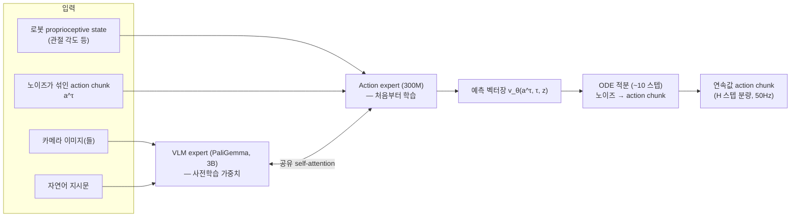

# 05. π0: A Vision-Language-Action Flow Model for General Robot Control

- **저자/소속**: Kevin Black, Noah Brown 등, Physical Intelligence, 2024.10
- **arXiv/PDF**: [pi0.pdf](https://www.pi.website/download/pi0.pdf) (arXiv 2410.24164)
- **한 줄 요약**: action을 discrete bin으로 자르지 않고 **flow matching**으로 직접 연속 궤적을 생성해, discretization 손실 없이 **50Hz 실시간** dexterous manipulation을 구현한 최초의 대규모 VLA.

이전 논문: [04. OpenVLA](04-openvla.md)

---

## 1. 문제의식

RT-2/OpenVLA 계열은 모두 action을 **256-bin discrete token**으로 표현하고 **autoregressive하게 한 토큰씩** 생성한다. 이 방식의 근본적 한계 두 가지:

1. **정보 손실**: 연속적인 관절 각도/힘을 256단계로 자르면 미세한 힘 조절이 필요한 동작(옷감을 잡는 압력, 액체를 붓는 각도 등)에서 정밀도가 떨어진다.
2. **속도 한계**: 11(혹은 7)개 차원을 토큰 하나씩 순차적으로 디코딩해야 하므로, action 하나를 만드는 데도 여러 번의 forward pass가 필요 — 빠른 dexterous task(옷 개기 등)에 필요한 고주파(50Hz) 제어가 어렵다.

π0의 질문: **"디코딩을 아예 이산 토큰 생성이 아니라 연속 벡터장(vector field) 추정 문제로 바꾸면 어떨까?"** → 이미지 생성에서 diffusion보다 빠르고 안정적이라고 알려진 **flow matching**을 action 생성에 적용한다.

## 2. 아키텍처 — VLM 백본 + Action Expert (Mixture 구조)

π0는 **하나의 Transformer 안에 두 세트의 가중치("expert")** 를 둔 구조다.

- **VLM expert**: 사전학습된 **PaliGemma(3B)**. 이미지·언어 토큰을 처리 — 원래 VLM 사전학습 때 보던 것과 같은 종류의 입력이므로 사전학습 가중치를 거의 그대로 재사용
- **Action expert**: **300M** 파라미터, **처음부터(from scratch) 학습**. 로봇 state와 "노이즈가 섞인 action" 같이 VLM 사전학습 때 전혀 본 적 없는 새로운 종류의 입력을 전담

두 expert는 **완전히 분리된 네트워크가 아니라 self-attention layer를 통해서만 정보를 주고받는다** — 토큰의 "종류"(이미지/언어 vs. state/action)에 따라 어느 expert의 가중치를 쓸지가 결정되는, 일종의 결정론적(하드 라우팅) Mixture-of-Experts 구조. 전체 파라미터 수는 **3B + 300M = 3.3B**.

## 3. Flow Matching — 수식

핵심은 "노이즈에서 실제 action으로 가는 벡터장(velocity field)"을 학습하는 것이다. Rectified-flow / conditional flow matching 방식을 따른다.

**보간 경로 정의**: 실제 action chunk $a$ (여러 미래 스텝을 묶은 벡터, action chunking)와 가우시안 노이즈 $\epsilon \sim \mathcal{N}(0, I)$ 사이를, 시간 $\tau \in [0, 1]$ 에 대해 **직선으로 보간**한다:

$$
a^\tau = \tau \, a + (1 - \tau)\, \epsilon
$$

($\tau = 0$ 이면 순수 노이즈, $\tau = 1$ 이면 실제 action)

**타겟 벡터장**: 이 직선 경로를 따라가는 속도(velocity)는 시간에 무관하게 항상 $a - \epsilon$ 로 일정하다:

$$
u(a^\tau \mid a, \epsilon) = a - \epsilon
$$

**학습 손실**: 모델 $v_\theta$ 가 현재 위치 $a^\tau$, 시간 $\tau$, 그리고 관측 조건 $z$(이미지+언어+state를 인코딩한 표현)을 보고 이 속도를 예측하도록 회귀 학습:

$$
\mathcal{L}_{\text{flow}} = \mathbb{E}_{\tau,\, \epsilon,\, a}\left[\left\| v_\theta(a^\tau, \tau, z) - (a - \epsilon) \right\|^2\right]
$$

**추론(action 생성)**: 가우시안 노이즈 $a^0 = \epsilon$ 에서 출발해, 학습된 벡터장을 따라 상미분방정식(ODE)을 적분한다:

$$
\frac{da^\tau}{d\tau} = v_\theta(a^\tau, \tau, z), \qquad a^1 = a^0 + \int_0^1 v_\theta(a^\tau, \tau, z)\, d\tau
$$

실제로는 이 적분을 **약 10step 정도의 오일러(Euler) 적분**으로 근사한다 — 표준 DDPM diffusion이 보통 수십~수백 step을 요구하는 것과 대비된다. Step 수가 훨씬 적기 때문에 action expert(300M, VLM 3B보다 훨씬 작음)만 반복 실행하면 되고, 그 결과 **50Hz** 실시간 제어가 가능해진다. VLM expert는 매 제어 주기마다 다시 돌릴 필요 없이 한 번 인코딩한 관측 조건 $z$ 를 여러 ODE step에서 재사용할 수 있다는 점도 속도에 기여한다.

## 4. 학습 데이터

- 자체 수집한 **10,000시간 이상**의 로봇 시연 + Open X-Embodiment 등 외부 데이터
- **7개 서로 다른 로봇 플랫폼** (single-arm UR5e/Franka, bimanual UR5e, bimanual Trossen(ALOHA류), mobile manipulator 등), **68개 고유 태스크**
- 대부분 **teleoperation 기반 dexterous manipulation** 데이터에 초점 (옷 개기, 식기세척기 정리, 식탁 정리, 장바구니 포장, 박스 조립 등) — RT류가 주로 pick-and-place였던 것과 달리 **양손 협응이 필요한 장기(long-horizon) 태스크**를 target으로 함
- 학습은 대규모 사전학습(pretraining) 후 태스크별 고품질 데이터로 post-training하는 2단계 구조

## 5. 실험 결과

- 세탁물 개기(laundry folding), 식탁 치우기(bussing), 장바구니 포장(bagging), 박스 조립, 물건 회수 등 **복잡한 dexterous·multi-stage 태스크에서 SOTA**
- **Zero-shot과 fine-tuned 모두**에서 강한 성능 — 여러 embodiment에 대해 하나의 사전학습된 정책으로 시작해 태스크별 fine-tuning 시 빠르게 향상
- Flow matching 방식이 기존 discrete-bin autoregressive 방식(OpenVLA류) 대비, 특히 **정밀한 힘 조절이 필요한 태스크**에서 우위를 보임 (논문 내 ablation에서 discretization 대비 flow matching의 이점 확인)
- 후속 버전(π0.7 등)에서는 cross-embodiment transfer 시나리오에서 셔츠 개기 태스크 기준 **80% 성공률, 85.6% task progress**를 보고 — 숙련된 사람 조작자에 필적하는 수준까지 발전

## 6. 한계 및 다음 논문과의 연결고리

- **아직 "학습 후 배포"에 머묾**: π0는 사전학습 + 태스크별 fine-tuning 구조지만, 배포된 이후 실제 사용 중 발생하는 실패로부터 지속적으로 개선하는 매커니즘은 없음.
- **Open-world(완전히 새로운 가정/환경)에서의 일반화는 제한적**: 학습 분포와 크게 다른 새로운 환경에서는 여전히 실패율이 높음.
- 이 두 한계가 각각 **π0.5**(open-world generalization)와 **π*0.6**(배포 후 경험 기반 학습)의 직접적인 문제의식으로 이어진다.

**다음 논문**: [06. π0.5](06-pi05.md) — π0를 처음 보는 실제 가정집 환경에서도 동작하도록 확장하는 후속 연구.
