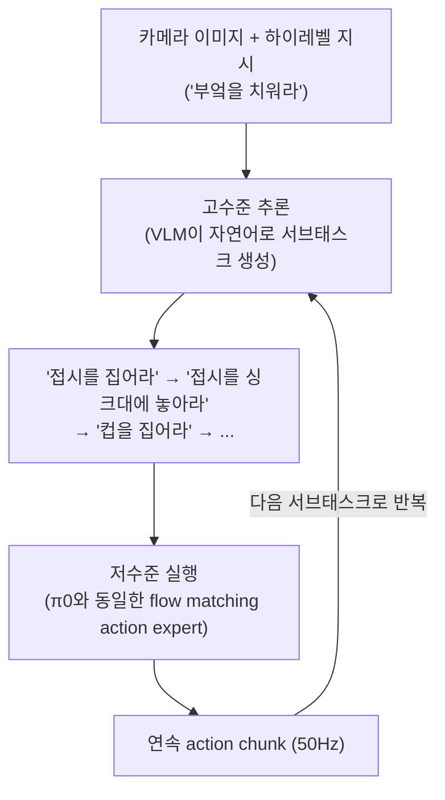

# 06. π0.5: a Vision-Language-Action Model with Open-World Generalization

- **저자/소속**: Physical Intelligence, 2025.04
- **arXiv/PDF**: [2504.16054](https://arxiv.org/abs/2504.16054)
- **한 줄 요약**: π0의 flow matching 저수준 제어는 유지하되, **고수준 의미적 추론(hierarchical inference)** 과 **다종 데이터 co-training**을 더해, 학습 때 전혀 보지 못한 실제 가정집에서도 청소 같은 장기(long-horizon) 작업을 수행하게 만든 모델.

이전 논문: [05. π0](05-pi0.md)

---

## 1. 문제의식

π0를 포함한 대부분의 VLA는 **학습 환경과 매우 비슷한 환경**에서만 평가된다 — 같은 부엌, 같은 조명, 비슷한 배치의 물건들. 하지만 실제 배포 시나리오(가정용 로봇)는 "본 적 없는 집"에서 동작해야 한다.

**핵심 질문**: 로봇 정책이 완전히 새로운 가정(집 구조, 가구 배치, 물건 종류가 전부 다른)에서 "그릇을 싱크대에 넣어라", "옷을 빨래 바구니에 넣어라" 같은 **다단계(multi-stage), 장기(10~15분 소요)** 작업을 수행할 수 있는가? 그리고 그러려면 무엇이 필요한가?

## 2. 핵심 아이디어 1 — 계층적 추론(Hierarchical Inference)

π0가 "지시문 → 즉시 action"으로 한 번에 매핑했다면, π0.5는 그 사이에 **의미적 서브태스크(semantic subtask) 추론 단계**를 끼워 넣는다.

즉 모델이 스스로 "지금 이 장면에서 다음에 뭘 해야 하는가"를 자연어 서브태스크로 먼저 생성(고수준, semantic reasoning)한 뒤, 그 서브태스크를 π0와 같은 저수준 flow matching 모듈이 실제 모터 동작으로 변환한다. 이 분리 덕분에:

- 고수준 추론은 VLM의 웹 사전학습 지식(사물 인식, 상식적 작업 순서)을 최대한 활용
- 저수준 실행은 여전히 정밀한 연속 제어(π0의 강점)를 유지

## 3. 핵심 아이디어 2 — 이질적 데이터 Co-training

π0.5의 두 번째 핵심은 **학습 데이터의 다양성 자체를 일반화의 원천으로 취급**한다는 점이다. 하나의 co-training 레시피 안에 다음을 모두 섞는다:

- 자체 로봇의 다단계 시연 데이터
- **다른 로봇들의 데이터** (cross-embodiment)
- **고수준 명령(verbal high-level command) 데이터** — "부엌 치워"처럼 구체적 동작이 아니라 목표만 주어진 지시
- 웹 규모 vision-language 데이터 (RT-2/π0와 유사한 목적)
- **다수의 서로 다른 실제 환경(집)에서 수집한 데이터**

### 환경 다양성에 대한 정량적 발견

논문의 흥미로운 결과 하나: 학습에 포함된 **분포 밖(out-of-distribution) 환경이 약 100개** 정도만 되어도, 그 환경들에 대한 성능이 (수백 시간 분량으로 깊게 학습된) 분포 내(in-distribution) 환경 성능과 **비슷하거나 그 이상**이 된다. 즉 "무한히 많은 환경"이 아니라 **적당한 규모의 환경 다양성**만으로도 실질적인 open-world 일반화가 가능하다 — 이는 실제 데이터 수집 비용을 고려할 때 산업적으로 중요한 시사점이다.

## 4. 실험 결과

- 완전히 새로운(학습 데이터에 없는) **3개의 실제 가정집**에서 모바일 매니퓰레이터로 평가
- **10~15분 길이의 다단계 작업**(그릇을 싱크대에, 옷을 빨래 바구니에, 서랍 정리 등)을 성공적으로 수행
- 학습 시 한 번도 보지 못한 집에서도, 그 집을 이미 본 적 있는(in-distribution) 통제 모델과 **비슷한 수준의 완료율**을 기록 — 강한 일반화의 직접적 증거
- 계층적 추론(고수준 서브태스크 생성)을 제거한 ablation에서는 장기 작업 완료율이 크게 하락 — "다음에 뭘 해야 하는지"를 스스로 계획하는 능력이 open-world 일반화의 핵심 기여 요소임을 확인

## 5. 한계 및 다음 논문과의 연결고리

- **여전히 "한 번 배포하면 고정"**: π0.5도 π0와 마찬가지로 사전학습+fine-tuning 이후에는 정책이 고정된다. 배포 후 실패 사례로부터 자동으로 개선되지는 않는다.
- **고수준 추론의 실패가 전체 실패로 이어짐**: 계층 구조상 상위 계획이 틀리면(예: 잘못된 서브태스크 생성) 하위 실행이 아무리 정확해도 작업이 실패한다 — 계획-실행 분리 구조의 전형적 약점.
- 배포 후 실제 사용 경험(성공/실패 피드백)을 통해 정책이 스스로 개선되도록 만드는 것이 다음 단계의 문제의식이 된다.

**다음 논문**: [07. π*0.6](07-pi06.md) — 배포된 로봇의 실제 경험 데이터로부터 지속적으로 학습(continual improvement)하는 π 계열의 최신 버전.
