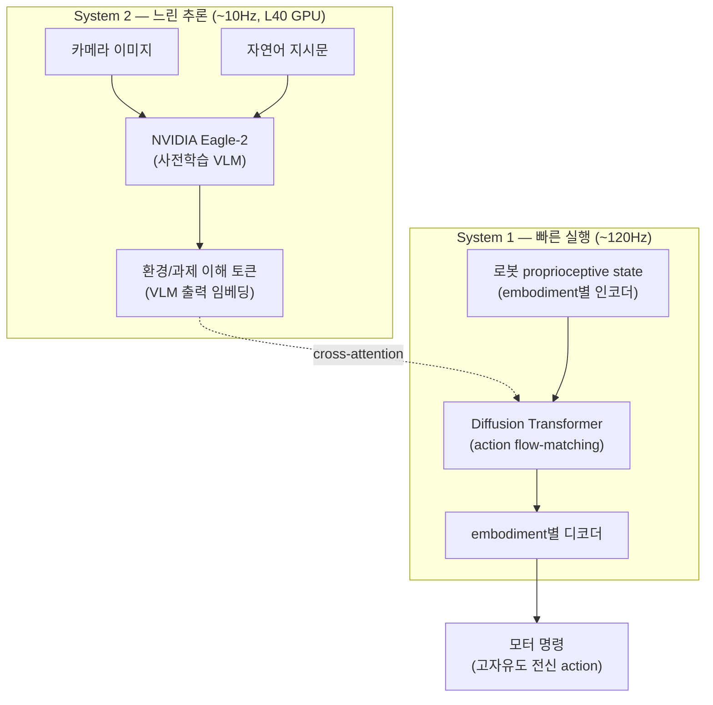
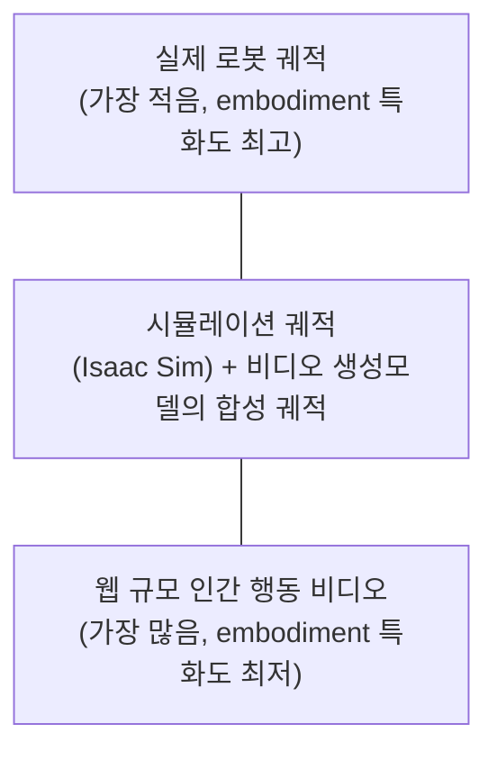

# 08. GR00T N1: An Open Foundation Model for Generalist Humanoid Robots

- **저자/소속**: NVIDIA (GEAR Lab 등), 2025.03
- **arXiv**: [2503.14734](https://arxiv.org/abs/2503.14734)
- **한 줄 요약**: "느리지만 똑똑한 추론"과 "빠르지만 단순한 실행"을 하나의 모델 안에서 **물리적으로 분리된 두 시스템**(System 2 VLM + System 1 Diffusion Transformer)으로 나눠, 휴머노이드 로봇에 필요한 실시간성과 범용 추론을 동시에 잡으려는 NVIDIA의 오픈 파운데이션 모델.

이전 논문: [07. π*0.6](07-pi06.md)

---

## 1. 문제의식

π0 계열은 VLM expert와 action expert를 **하나의 Transformer 안에서 self-attention으로 결합**했다. GR00T N1은 조금 다른 절충을 택한다 — **Kahneman의 "시스템 1/시스템 2" 이중과정 이론**에서 착안해, 두 모듈을 아예 **다른 처리 주기(frequency)로 분리된 두 개의 네트워크**로 설계한다.

- 인간형(humanoid) 로봇은 자유도가 매우 높고(수십 개의 관절), 양손 협응·전신 균형 같은 고차원 실시간 제어가 필요
- 동시에 "이 상황에서 무엇을 해야 하는가"를 판단하려면 대형 VLM 수준의 시각-언어 이해가 필요
- 이 둘을 하나의 네트워크로 매 스텝 동시에 다 돌리면 느려서 고자유도 실시간 제어가 불가능 → **아예 주기를 분리하자**

## 2. 아키텍처 — Dual-System 구조

### 2.1 System 2 — 시각-언어 추론 모듈

- 사전학습된 VLM(**NVIDIA Eagle-2**)이 카메라 이미지와 언어 지시를 받아 "지금 상황이 뭐고 뭘 해야 하는가"를 이해
- **약 10Hz**로 동작 (NVIDIA L40 GPU 기준) — 사람이 "다음에 뭘 할지" 생각하는 속도에 해당하는, 상대적으로 느린 고차원 판단
- 출력은 텍스트가 아니라 **VLM 내부 토큰 임베딩**(환경/과제에 대한 표현) — 이걸 System 1이 조건으로 받음

### 2.2 System 1 — Diffusion Transformer 실행 모듈

- **Diffusion Transformer**가 System 2의 출력 토큰에 **cross-attention**으로 접근하면서, 로봇의 현재 proprioceptive state(관절 각도 등)를 조건으로 실제 모터 동작을 생성
- 학습은 **action flow-matching** 방식 (π0와 유사한 원리: 노이즈에서 실제 action으로 가는 벡터장을 학습해 반복 denoising으로 action 생성)
- **약 120Hz**로 동작 — 사람의 "반사적/숙련된 운동 제어"에 해당하는 고주파 실시간 루프
- **Embodiment-specific encoder/decoder**: 로봇마다 관절 수, action 차원이 다르므로, state를 표준화된 잠재 공간으로 매핑하는 인코더와 그 잠재 공간에서 다시 실제 로봇의 action 차원으로 매핑하는 디코더를 **로봇 종류별로 별도로 둠** — 이렇게 하면 몸통 구조가 다른 여러 휴머노이드(Fourier GR-1, 1X 등)를 하나의 공유 백본으로 다룰 수 있음

두 시스템은 **완전히 독립적으로 학습되는 게 아니라 end-to-end로 jointly 학습**된다 — System 1의 gradient가 System 2까지 역전파되어, VLM의 표현 자체도 로봇 제어에 유용하도록 조정된다.

## 3. 학습 데이터 — Data Pyramid

로봇 데이터는 절대적으로 부족하다는 문제를, GR00T N1은 **"데이터 피라미드"**로 해결한다 — 아래로 갈수록 양은 많지만 로봇 특화도가 낮고, 위로 갈수록 양은 적지만 정확히 그 로봇에 특화된 데이터다.

- **최하단(웹/인간 비디오)**: action label이 없는 방대한 인간 행동 영상. **학습된 latent-action codebook**과 **inverse dynamics model(IDM)**을 이용해 "이 영상에서 어떤 동작이 일어났을지"에 대한 **의사(pseudo) action label**을 추론해 학습에 사용 — 로봇으로 한 번도 수집되지 않은 지식(사물 조작 상식)까지 흡수하는 통로
- **중간(합성 데이터)**: NVIDIA Isaac Sim으로 생성한 시뮬레이션 궤적, 그리고 비디오 생성 모델([Cosmos](10-cosmos.md) 등)로 만든 synthetic trajectory — real robot teleoperation 없이도 대량의 다양한 시나리오를 값싸게 확보
- **최상단(실제 로봇 궤적)**: 가장 적지만 가장 정확한 embodiment-specific 데이터. 최종 fine-tuning 단계에서 비중 있게 사용

이 세 계층을 하나의 학습 배치 안에서 함께 샘플링해 end-to-end로 사전학습한다 — RT-2의 co-fine-tuning, π0.5의 이질적 co-training과 같은 계보의 아이디어를 "액션 라벨이 아예 없는 데이터"까지 포함하도록 확장한 것.

## 4. 실험 결과

**시뮬레이션 벤치마크 3종**: RoboCasa Kitchen(24개 태스크), DexMimicGen Cross-Embodiment Suite(9개 태스크), GR-1 Tabletop(24개 태스크) — 이 모두에서 **기존 모방학습 baseline 대비 우수한 성능**을 여러 embodiment에 걸쳐 일관되게 기록

**실물 Fourier GR-1 휴머노이드 평가**:
- 양손 협응 물건 전달(coordinated bimanual handover) 태스크: **76.6%** 성공률(11.5/15)
- 처음 보는 물건을 처음 보는 용기에 담는 태스크: **73.3%** 성공률(11/15)
- 실물 양손 조작 태스크 종합: **38.3%** 성공률 — 시뮬레이션보다는 낮지만, 언어 조건화된 가정용 작업을 소량의 실제 데이터로도 수행 가능함을 보여주는 데이터 효율성이 강조됨

## 5. 한계 및 다음 논문과의 연결고리

- **두 시스템 간 주기 차이로 인한 정보 지연**: System 2가 10Hz로만 갱신되므로, 그 사이(100ms) 동안 환경이 급격히 바뀌면 System 1이 낡은 맥락 정보로 동작할 수 있음 — π0처럼 하나의 네트워크로 결합한 방식과의 트레이드오프(속도 vs. 반응성)
- **여전히 real robot 데이터가 최종 성능의 병목**: data pyramid로 완화했지만, 실물 성공률(38.3%)이 시뮬레이션보다 훨씬 낮다는 건 sim-to-real, video-to-real 격차가 여전히 존재함을 시사
- 데이터 피라미드의 중간 계층(합성 궤적)에 쓰이는 비디오 생성 모델 자체가 별도 연구 주제 — 이게 바로 다음에 다룰 **Cosmos**(NVIDIA의 World Foundation Model)와 직접 연결된다.

**다음 논문**: [10. Cosmos](10-cosmos.md) — "행동을 생성"하는 GR00T와 달리 "세계 자체를 시뮬레이션"하는 NVIDIA의 World Foundation Model. (09. Helix는 함께 정리 예정)
