# 09. Helix: A Vision-Language-Action Model for Generalist Humanoid Control

- **저자/소속**: Figure AI, 2025.02 (※ 정식 arXiv 논문이 아니라 회사 기술 블로그/기술 리포트 형태로 공개됨)
- **출처**: [figure.ai/news/helix](https://www.figure.ai/news/helix)
- **한 줄 요약**: GR00T N1과 비슷한 **System 1/System 2 이중 구조**를 훨씬 작은 자원(80M 실행 모듈)으로 구현해 **200Hz 전신 상체 제어**를 달성하고, **하나의 가중치 세트로 두 대의 로봇이 협업**까지 하는 상용 배포 지향 VLA.

이전 논문: [08. GR00T N1](08-groot-n1.md)

---

## 1. 문제의식

GR00T N1이 "느린 VLM + 빠른 diffusion" 구조의 연구적 타당성을 보였다면, Figure AI는 이걸 **실제 상용 휴머노이드(Figure 02)에 배포 가능한 수준으로 경량화**하는 데 초점을 맞췄다. 특히:

- 휴머노이드 **상체 전체**(양팔, 손가락 개별 관절, 손목, 몸통, 머리 방향까지)를 하나의 정책으로 통제해야 함 — GR00T보다 더 세밀한 자유도
- 실시간성이 생명인데(200Hz급), System 2(대형 VLM)를 매번 다 돌리면 그 속도가 안 나옴
- **태스크별 fine-tuning 없이** 하나의 가중치 세트로 최대한 다양한 상황(수천 종의 처음 보는 물체, 서랍/냉장고 조작, 다중 로봇 협업)을 커버해야 상용 배포가 현실적

## 2. 아키텍처 — 훨씬 가벼운 Dual-System

- **System 2**: 인터넷 규모로 사전학습된 **7B 오픈소스/오픈웨이트 VLM**. 장면 이해와 언어 이해를 담당하는, 상대적으로 느린 모듈
- **System 1**: **단 80M 파라미터**의 작은 Transformer. System 2가 만든 latent 표현을 비동기적으로 받아, 이미지 입력과 결합해 실시간으로 상체 전체의 연속 제어값을 생성
- **핵심은 System 1의 극단적 경량화**: GR00T N1의 diffusion transformer보다 훨씬 작은 모델로 200Hz라는 매우 높은 제어 주파수를 실제로 달성 — "정밀한 반사 신경"에 해당하는 부분은 최대한 가볍게, "생각"에 해당하는 부분만 무겁게 두는 설계 철학을 극단까지 밀어붙임
- System 1은 **별도의 실시간 프로세스**로 돌아가 200Hz 루프를 절대 놓치지 않도록 시스템 수준에서 보장

## 3. 학습 데이터와 방식

- **약 500시간 규모의 원격조작(teleoperation) 시연 데이터**로 학습 — π0(10,000시간+)나 GR00T(data pyramid)에 비해 **훨씬 적은 데이터**로 넓은 범용성을 노림
- **자동 라벨링 VLM**을 이용해 시연 영상에 자연어 지시문을 자동 생성·부착 — 사람이 일일이 지시문을 라벨링하는 비용을 줄임
- **태스크별 fine-tuning 없음**: 물건 집어서 담기, 서랍/냉장고 조작, 로봇 간 물건 전달까지 모두 **단 하나의 가중치 세트**로 학습 — RT-2/OpenVLA류가 태스크별로 fine-tuning하는 것과 대비되는 지점

## 4. 실험 결과 — 특히 흥미로운 멀티로봇 협업

- **수천 종의 처음 보는 물체**를 다양한 용기에 담는 작업, 서랍·냉장고 조작 등에서 광범위한 zero-shot 성능
- **동일한 가중치를 가진 두 대의 로봇을 같은 공간에 배치**하고 "쿠키 봉지를 오른쪽 로봇에게 건네줘" 같은 자연어 지시를 줬을 때, **로봇 간 명시적 통신이나 스크립트화된 역할 분담 없이** 각 로봇이 System 2(VLM)로 전체 장면과 상대 로봇의 움직임을 관찰해 **스스로 자기가 맡아야 할 서브태스크를 추론**하고 협업에 성공
- 이건 "각 로봇이 상대방의 상태를 보고 암묵적으로 조율한다"는 emergent coordination의 사례로, 명시적 멀티에이전트 프로토콜 없이 관찰 기반으로 협업이 가능함을 실증

## 5. 한계 및 다음 논문과의 연결고리

- **정식 논문(peer-reviewed) 형태가 아님**: 상세한 ablation, 정량적 벤치마크 수치, 실패 사례 분석 등이 학술 논문만큼 투명하게 공개되지는 않음 — 기술 블로그 특성상 마케팅적 서술과 기술적 사실이 섞여 있을 수 있어 다른 논문 대비 비판적으로 읽을 필요가 있음
- **500시간이라는 상대적으로 적은 데이터로 넓은 범용성을 주장**하는데, 이게 정말 일반화인지 아니면 평가 시나리오가 학습 분포와 가깝기 때문인지 독립적인 검증이 더 필요
- GR00T N1과 Helix 모두 "행동 생성" 축의 끝판왕들이지만, 이들이 사용하는 **synthetic/시뮬레이션 데이터를 어떻게 만드는가**라는 질문이 남는다 — 다음 논문인 **Cosmos**가 바로 그 "세계 자체를 시뮬레이션하는" 축을 다룬다.

**다음 논문**: [10. Cosmos](10-cosmos.md) — NVIDIA의 World Foundation Model 플랫폼. GR00T/Helix 같은 VLA들이 학습에 쓸 synthetic 데이터를 생성하는 데도 쓰이는, "행동"이 아니라 "세계 시뮬레이션" 축의 핵심 논문.
