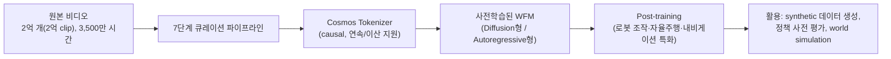

# 10. Cosmos World Foundation Model Platform for Physical AI

- **저자/소속**: NVIDIA, 2025.01
- **arXiv**: [2501.03575](https://arxiv.org/abs/2501.03575)
- **한 줄 요약**: "행동을 생성"하는 VLA와 달리, **"물리 세계 자체를 예측/시뮬레이션"** 하는 대형 비디오 파운데이션 모델(World Foundation Model, WFM) 플랫폼. GR00T 같은 VLA들의 synthetic 학습 데이터를 만드는 데도 쓰이는, Physical AI의 "디지털 트윈" 축.

이전 논문: [09. Helix](09-helix.md)

---

## 1. 문제의식 — 왜 "행동 생성"과 별개로 "세계 시뮬레이션"이 필요한가

지금까지의 RT-1 ~ Helix는 모두 "관측이 주어졌을 때 어떤 행동을 해야 하는가"를 학습하는 **정책(policy)** 모델이다. 그런데 이런 정책을 학습·평가하려면 애초에 **막대한 양의 (관측, 행동, 다음 관측) 데이터**가 필요한데, 실제 로봇으로 이걸 수집하는 건 매우 느리고 비싸다.

**핵심 아이디어**: "어떤 행동을 하면 세계가 어떻게 바뀌는가"를 예측하는 별도의 모델(World Model)을 대규모 비디오 데이터로 학습해두면, 이 모델로:

1. 실제 로봇 없이 **가상의 (관측, 행동, 다음 관측) 데이터를 대량 생성**해 정책 학습에 쓸 수 있고 (→ GR00T의 data pyramid 중간층)
2. 정책이 생성한 행동을 실제로 실행하지 않고도 **시뮬레이션해서 미리 평가**할 수 있다

즉 Cosmos는 "세계 시뮬레이터를 하나의 파운데이션 모델로 만들어, Physical AI 생태계 전체가 재사용할 수 있는 인프라로 제공"하겠다는 프로젝트다.

## 2. 플랫폼 구성 요소

### 2.1 비디오 큐레이션 파이프라인 (7단계)

자체 보유 영상 + 공개 인터넷 영상(운전, 손-물체 상호작용, 사람 활동, 내비게이션, 자연 풍경 등)에서 시작해 다음 7단계를 거친다:

1. **Shot-aware 분할**: 장면 전환(cut) 단위로 비디오를 자름 — 물리적으로 연속된 구간만 하나의 학습 클립이 되게 함
2. **GPU 기반 트랜스코딩**: 대규모 포맷 표준화
3. **크로핑**: 불필요한 여백/워터마크 등 제거
4. **필터링**: 저품질, 부적절한 콘텐츠 제거
5. **캡셔닝**: 각 클립에 대한 자동 캡션 생성 (텍스트 조건화 학습을 위해)
6. **의미적 중복 제거(semantic deduplication)**: 비슷한 내용의 클립이 과도하게 중복되지 않도록 임베딩 기반으로 제거
7. **샤딩(sharding)**: 대규모 분산 학습을 위한 데이터 분할 저장

**규모**: **2억 개 이상의 원본 비디오**, 총 **3,500만 시간** 분량을 처리해 큐레이션.

### 2.2 Cosmos Tokenizer — Causal 설계가 핵심

비디오를 그대로 다루기엔 차원이 너무 크므로, 먼저 압축된 토큰 표현으로 바꾼다. 이때 **연속(continuous) 토큰**(diffusion 모델용)과 **이산(discrete) 토큰**(autoregressive 모델용)을 모두 지원하는 통합 토크나이저를 설계했다.

가장 중요한 설계 원칙은 **인과성(causality)**이다: 현재 프레임을 토큰화할 때 **미래 프레임의 정보를 전혀 사용하지 않는다.** 이는 Physical AI 시스템(로봇, 자율주행차)이 실제로 살아가는 세계가 인과적(현재는 미래를 알 수 없음)이라는 사실과 정확히 대응하도록 설계된 것 — 미래를 "훔쳐본" 토큰화는 실시간 예측·제어 상황에서 쓸모가 없기 때문.

### 2.3 두 갈래의 아키텍처 — Diffusion형 vs. Autoregressive형

둘 다 Transformer 기반으로 스케일링 가능하게 설계했다.

**(a) Diffusion 기반 WFM**
- 토크나이저의 **연속 latent 공간**에서 동작하는 **latent diffusion model**
- 표준 diffusion 학습 원리: 실제 latent 비디오 표현 $x_0$ 에 노이즈를 단계적으로 추가한 $x_t$ 로부터 노이즈 $\epsilon$을 예측하도록 학습

$$
\mathcal{L}_{\text{diffusion}} = \mathbb{E}_{x_0, \epsilon, t}\left[\left\|\epsilon - \epsilon_\theta(x_t, t, c)\right\|^2\right]
$$

여기서 $c$ 는 텍스트 캡션/조건(과거 프레임, 행동 등)이다. 추론 시 노이즈에서 출발해 반복적으로 denoise하며 미래 비디오 latent를 생성

**(b) Autoregressive 기반 WFM**
- 토크나이저의 **이산 토큰**(Cosmos-Tokenizer-DV: 비디오를 정수 시퀀스로 매핑)을 GPT류처럼 **다음 토큰 예측**으로 생성
- 언어모델과 동일한 next-token cross-entropy 목적함수를 비디오 토큰 시퀀스에 적용

각 계열마다 **기본 모델(base model) 2종 + 파생 모델(derivative model) 2종**을 구축했고, diffusion 계열에는 텍스트 프롬프트를 더 상세하게 확장하는 **prompt upsampler**를, autoregressive 계열에는 이산 토큰을 다시 고화질 비디오로 되돌리는 **diffusion decoder**를 추가로 붙여 생성 품질을 높였다.

### 2.4 Post-training — 범용 WFM을 특정 용도로 특화

사전학습된 WFM은 "세계가 대략 어떻게 흘러가는지"에 대한 범용 지식만 가진 상태다. 이를 실제 활용을 위해 후속 학습(post-training)한다:

- **로봇 동작 시뮬레이션**: 특정 로봇의 행동이 주어졌을 때 그 결과 영상을 예측하도록 조건화 → GR00T의 data pyramid 중간층에 쓰이는 synthetic trajectory 생성원
- **가상 세계 내비게이션**: 이동 행동에 따른 시점 변화 예측
- **자율주행 시뮬레이션**: 운전 행동에 따른 도로 상황 예측 → World4Drive류 자율주행 world model과 연결

## 3. Physical AI 생태계에서 Cosmos의 위치

Cosmos는 **오픈소스/오픈웨이트로 공개**되어, 개별 연구팀이나 기업이 자기 로봇/차량에 맞게 fine-tuning할 수 있는 **공용 인프라(플랫폼)**로 포지셔닝되어 있다. 이 점에서 RT-2/π0 같은 "정책 모델"과는 다른 층위의 기여다 — Cosmos 자체는 행동을 생성하지 않고, **행동의 결과를 예측**함으로써 정책 학습에 필요한 데이터와 평가 수단을 제공한다.

## 4. 한계 및 다음 논문과의 연결고리

- **예측이 곧 정확한 물리 시뮬레이션은 아님**: 비디오 생성 모델은 "그럴듯해 보이는" 미래를 만들 뿐, 실제 물리 법칙(마찰, 관성, 강체 충돌 등)을 명시적으로 모델링하지 않음 — 미세한 물리적 부정확성이 이를 이용해 학습한 정책의 sim-to-real 격차로 이어질 수 있음
- **긴 시간축 예측의 일관성 문제**: 비디오 생성 모델 특유의 장기 예측 시 디테일 붕괴/일관성 저하 문제가 WFM에도 그대로 나타날 수 있음
- 이런 한계를 개선하려는 후속 연구가 바로 다음에 다룰 **World Simulation with Video Foundation Models** (Cosmos-Predict2.5 계열) — 텍스트/이미지/비디오 조건화를 하나의 flow 기반 모델로 통합하고 RL 기반 post-training으로 품질을 개선.

**다음 논문**: [11. World Simulation with Video Foundation Models for Physical AI](11-world-simulation.md) — Cosmos의 최신 후속 연구.
