# 11. World Simulation with Video Foundation Models for Physical AI (Cosmos-Predict2.5)

- **저자/소속**: NVIDIA, 2025.11
- **arXiv**: [2511.00062](https://arxiv.org/abs/2511.00062)
- **한 줄 요약**: Cosmos의 후속작. Text2World/Image2World/Video2World로 나뉘어 있던 생성 방식을 **하나의 flow 기반 모델**로 통합하고, **RL 기반 post-training**으로 명령 정합성과 장기 일관성을 개선한 차세대 World Foundation Model.

이전 논문: [10. Cosmos](10-cosmos.md)

---

## 1. Cosmos(2025.01) 대비 달라진 점

1세대 Cosmos는 **Diffusion형과 Autoregressive형이 별도 계열**로 나뉘어 있었고, 조건(텍스트만/이미지만/비디오만)에 따라 사실상 다른 모델을 써야 했다. Cosmos-Predict2.5는 이걸 하나로 합친다.

## 2. 아키텍처 — 통합 Flow 기반 모델

- **하나의 flow 기반 diffusion 프레임워크**로 Text2World(텍스트만으로 세계 생성), Image2World(시작 이미지로부터 이후 전개 예측), Video2World(비디오 앞부분을 보고 이어지는 미래 예측)를 **모두 같은 백본**에서 처리
- 텍스트 인코더로 범용 언어모델 대신 **Cosmos-Reason1**(Physical AI 특화 reasoning VLM)을 사용 — "컵이 테이블에서 떨어지면 깨진다" 같은 물리적 상식을 반영한 grounding을 제공해, 생성되는 미래 비디오가 지시문의 의도와 물리적으로 더 정합적이도록 유도
- 학습 원리는 Cosmos 1세대의 diffusion 목적함수(노이즈 예측)와 동일한 flow matching 계열이지만, **조건 종류에 무관하게 하나의 파라미터 세트**로 처리하도록 통합

## 3. 학습 — RL 기반 Post-training과 모델 병합(Model Merging)

- **2억(200M)개의 큐레이션된 비디오 클립**으로 사전학습 (Cosmos 1세대의 3,500만 시간 규모 원본에서 더 정제된 서브셋)
- 사전학습 이후, **강화학습 기반 post-training**을 도입해 (a) 생성된 비디오가 지시문을 얼마나 잘 따르는지(instruction alignment), (b) 물리적으로 그럴듯한지를 보상 신호로 활용해 개선
- **모델 병합(model merging)**: 서로 다른 post-training 목표(품질/정합성/도메인 특화 등)로 각각 학습된 여러 모델의 가중치를 병합해, 여러 장점을 한 모델에 통합하는 기법을 함께 사용
- **2B, 14B 두 규모**로 공개 — 자원 제약에 따라 선택 가능

## 4. 도메인 특화 변형 모델

범용 WFM 외에, 실제 응용에 맞춘 멀티뷰(multiview) 특화 버전을 함께 제공:

- **Cosmos-Predict2.5-2B/auto/multiview**: 자율주행용, **7-카메라 뷰**를 동시에 예측 — 차량을 둘러싼 전방위 시야를 일관되게 시뮬레이션 (→ [EMMA](12-emma.md), [World4Drive](13-world4drive.md)류 자율주행 world model과 직결)
- **Cosmos-Predict2.5-2B/robot/multiview**: 로봇 조작용, **3-카메라 뷰**로 조작 장면을 시뮬레이션 (→ GR00T의 data pyramid 중간층 생성원으로 활용 가능)

## 5. 결과

- Cosmos-Predict1(1세대) 대비 **영상 품질과 프롬프트 정합성에서 큰 폭의 개선**을 다양한 벤치마크에서 확인
- **최대 30초 길이**의 시퀀스에서도 시공간적 일관성(spatial-temporal coherence)을 유지 — 장기 예측이 필요한 로봇 계획(planning)이나 시뮬레이션 활용에 중요한 능력
- 이런 개선이 실제로 의미하는 바: **더 신뢰할 수 있는 synthetic 데이터 생성**, **정책의 closed-loop 사전 평가**(실제 로봇 없이 world model 안에서 정책을 실행해보고 결과를 미리 확인)가 더 실용적인 수준에 도달했다는 것

## 6. Physical AI 지형에서의 의미 및 다음 파트로의 연결

Cosmos → Cosmos-Predict2.5로 이어지는 이 흐름은 "행동 생성(VLA)"과 "세계 예측(WFM)"이라는 Physical AI의 두 축 중 후자를 대표한다. 특히 **멀티뷰 자율주행 변형 모델**의 존재는 이 world model 계보가 로보틱스뿐 아니라 자율주행에도 직접 적용된다는 걸 보여준다 — 이제 이 응용 축을 자율주행 전용 논문들로 자세히 들여다본다.

**다음 논문**: [12. EMMA](12-emma.md) — Waymo가 Gemini 기반 멀티모달 LLM으로 자율주행을 "언어 문제"로 재정의한 End-to-End 모델.
