# 12. EMMA: End-to-End Multimodal Model for Autonomous Driving

- **저자/소속**: Jyh-Jing Hwang et al., Waymo, 2024.10
- **arXiv**: [2410.23262](https://arxiv.org/abs/2410.23262)
- **한 줄 요약**: 자율주행의 인식·예측·계획을 별도 모듈로 쪼개던 기존 파이프라인을 버리고, **Gemini 기반 멀티모달 LLM 하나로 카메라 이미지를 직접 주행 궤적/객체/도로 그래프로 매핑**하는 End-to-End 모델. RT-2의 "action을 언어로" 철학을 자율주행에 그대로 적용한 사례.

이전 논문: [11. World Simulation with Video Foundation Models for Physical AI](11-world-simulation.md)

---

## 1. 문제의식

전통적인 자율주행 스택은 **cascaded(직렬 연결) 구조**다: 인식(perception, 3D 객체 검출) → 예측(prediction, 다른 차량의 미래 궤적) → 계획(planning, 자차 궤적 결정)이 각각 별도로 학습된 모듈로 존재하고, 앞 단계의 오차가 뒷 단계로 누적된다. 또한 각 모듈은 자기 태스크에 특화된 표현만 다루기 때문에, **웹 규모 사전학습에서 얻은 상식(예: 공사 표지판을 보면 서행해야 한다, 구급차가 지나가면 길을 비켜야 한다)** 을 활용할 방법이 없다.

**핵심 질문**: RT-2가 "로봇 action을 언어 토큰으로 표현"해 VLM의 웹 지식을 로봇 제어로 끌어왔듯이, **자율주행의 궤적·객체·도로 요소도 전부 언어로 표현**하면 대형 멀티모달 LLM(Gemini)의 세계 지식과 추론 능력을 자율주행에 그대로 가져올 수 있지 않을까?

## 2. 핵심 아이디어 — 모든 것을 "언어 공간"으로

- **입력**: raw 카메라 이미지 + 내비게이션 지시나 자차 속도 같은 비-센서 정보(텍스트로 인코딩) — 별도의 3D 인식 파이프라인이나 HD맵 없이 카메라만 사용
- **출력**: 궤적의 (x, y) 좌표 시퀀스, 3D bounding box 좌표, 도로 그래프의 폴리라인 좌표 등 **원래는 구조화된 수치 데이터였던 것들을 모두 텍스트 문자열로 표현**
- **태스크 구분**: 하나의 모델이 여러 태스크를 수행하되, **태스크별 프롬프트**("Predict the future trajectory...", "Detect all vehicles...")로 어떤 출력을 원하는지 지정 — RT-2에서 action bin을 vocabulary의 안 쓰는 토큰에 매핑했던 것과 비슷하게, 여기서는 **좌표값을 텍스트 숫자 그대로 출력**하도록 함으로써 아키텍처 변경 없이 Gemini의 기존 언어 생성 능력을 재사용

이렇게 모든 입출력을 언어 공간으로 통일하면, Gemini가 사전학습에서 얻은 **세계 지식**(표지판 의미, 도로 관습, 상식적 위험 판단)과 **chain-of-thought 추론**을 자율주행 의사결정에 그대로 활용할 수 있다는 게 핵심 논지다.

## 3. Chain-of-Thought 기반 계획

EMMA는 궤적을 바로 출력하지 않고, 옵션으로 **중간 추론 과정을 텍스트로 생성한 뒤 최종 궤적을 출력**하도록 학습할 수 있다 — RT-2의 chain-of-thought 변형과 같은 아이디어. 예를 들어 "전방에 보행자가 횡단 중 → 감속 필요 → 목표 속도 X로 조정된 궤적" 같은 추론 사슬을 명시적으로 생성하게 하면, 최종 계획의 해석 가능성과 정확도가 함께 향상된다.

## 4. 학습 — 다중 태스크 Co-training

EMMA는 세 가지 태스크(궤적 계획, 3D 객체 검출, 도로 그래프 추정)를 **하나의 모델에 co-training**한다 — RT-2의 "로봇 데이터 + 웹 데이터" co-fine-tuning과 유사한 원리를, "여러 자율주행 서브태스크"에 적용한 것. 사용된 데이터셋:

- 공개 데이터셋: **nuScenes**, **Waymo Open Motion Dataset(WOMD)**, **Waymo Open Dataset(WOD)**
- 대규모 내부(internal) 데이터셋 3종: End-to-end motion planning용, 3D detection용, road graph estimation용 각각 별도 구축

논문에서 확인된 중요한 결과: **세 태스크를 함께 학습(co-training)하면 세 태스크 모두에서 개별 학습보다 성능이 향상**된다 — 태스크 간 지식이 서로 도움을 준다는 근거이며, "generalist 자율주행 모델"이라는 방향성을 뒷받침한다.

## 5. 실험 결과

- **nuScenes 모션 플래닝**: SOTA(state-of-the-art) 성능 달성
- **Waymo Open Motion Dataset(WOMD)**: 경쟁력 있는(competitive) 결과
- **Waymo Open Dataset(WOD) 카메라 기반 3D 객체 검출**: 카메라만 사용하는 방법들 중 경쟁력 있는 성능

## 6. 한계 및 다음 논문과의 연결고리

- **카메라 전용, LiDAR/레이더 미사용**: 실제 상용 자율주행 스택 대부분이 의존하는 정밀 3D 센싱 모달리티(LiDAR, 레이더)를 아직 통합하지 못함 — 논문도 이를 향후 과제로 명시
- **제한적인 이미지 프레임 수**: 계산 비용 문제로 한 번에 처리할 수 있는 시간축 프레임 수가 제한적 — 매우 긴 시간에 걸친 맥락 파악에 불리
- **3D/BEV 좌표·바운딩박스 라벨에 대한 지도학습 의존**: 이런 정밀 라벨은 대규모로 확보하기 비싸 확장성에 제약
- **연산 비용이 큼**: 대형 MLLM을 자율주행처럼 저지연이 필수적인 상황에 실시간 배포하기엔 여전히 무거움

이 중 **"정밀 3D 라벨 없이도 학습할 수 있는가?"** 라는 질문에 답하려는 시도가 바로 다음에 다룰 **World4Drive**다 — perception 라벨 없이 latent world model만으로 자율주행 계획을 학습한다.

**다음 논문**: [13. World4Drive](13-world4drive.md) — Annotation-free, latent world model 기반의 End-to-End 자율주행.
