# 13. World4Drive: End-to-End Autonomous Driving via Intention-aware Physical Latent World Model

- **저자/소속**: Zheng et al., 2025.07 (ICCV 2025)
- **arXiv**: [2507.00603](https://arxiv.org/abs/2507.00603)
- **한 줄 요약**: 사람이 라벨링한 3D 박스/BEV 라벨 없이(annotation-free), **의도(intention) 조건화 + latent world model**만으로 자율주행 계획을 자기지도학습(self-supervised)으로 훈련하는 End-to-End 프레임워크. EMMA가 못 다뤘던 "정밀 3D 라벨 의존성" 문제에 대한 답.

이전 논문: [12. EMMA](12-emma.md)

---

## 1. 문제의식

EMMA를 포함해 대부분의 End-to-End 자율주행 모델은 궤적을 잘 예측하도록 학습시키기 위해 **정밀한 3D/BEV 좌표, 바운딩박스 같은 고비용 인간 라벨**에 크게 의존한다. 이런 라벨은:

- 제작 비용이 매우 높아 데이터 규모 확장의 병목이 됨
- 라벨링 프로토콜(센서 캘리브레이션, 좌표계 정의 등)에 따라 노이즈가 섞이기 쉬움

**핵심 질문**: 사람이 만든 인식(perception) 라벨 없이, **주행 로그(카메라 영상 + 자차 궤적)만으로** 자율주행 계획을 학습할 수 있는가? World4Drive의 답은 "**의도를 명시적으로 표현하는 latent world model**을 도입하면 가능하다"는 것.

## 2. 아키텍처 개요

### 2.1 Vision Foundation Model 기반 장면 피처

사전학습된 vision foundation model(예: DINOv2류)로 카메라 영상을 인코딩해 **공간-의미적 prior가 풍부한 피처**를 얻는다. 사람이 명시적으로 "여기 차가 있다"고 라벨링하지 않아도, 대규모 사전학습에서 이미 물체/공간 구조에 대한 표현이 내재되어 있다는 전제.

### 2.2 Intention-aware 다중 궤적 생성

하나의 궤적만 예측하는 대신, **운전 의도(intention)** 를 여러 개의 이산적인 모드(직진/좌회전/우회전 등)로 나누고, **각 의도에 조건화된 별도의 후보 궤적**을 생성한다. 이렇게 하면 교차로 같은 다중 선택지 상황에서 "여러 그럴듯한 미래" 중 하나로 뭉개지지 않고(mode collapse 방지), 의도별로 명확히 구분된 후보군을 만들 수 있다.

### 2.3 Latent World Model — Annotation-Free 학습의 핵심

각 후보 궤적 $\tau_i$ 를 실행했을 때 세계가 어떻게 바뀔지를, **원시 픽셀이 아니라 latent 공간에서** 예측한다:

$$
\hat{z}_{t+1}^{(i)} = f_{\text{world}}\left(z_t, \tau_i\right)
$$

여기서 $z_t$ 는 현재 장면의 latent 피처, $\hat{z}_{t+1}^{(i)}$ 는 궤적 $\tau_i$ 를 따랐을 때 예상되는 다음 시점의 latent 피처다.

**학습 신호는 사람 라벨이 아니라 실제 주행 로그의 "다음 프레임"** 에서 나온다 — 실제로 자차가 취한 궤적 $\tau^*$ 를 따라갔을 때 관측된 다음 프레임을 같은 vision foundation model로 인코딩한 $z_{t+1}$ 을 타겟으로 삼아:

$$
\mathcal{L}_{\text{world}} = \left\| f_{\text{world}}(z_t, \tau^*) - z_{t+1} \right\|^2
$$

이 손실은 **비디오와 실제 주행 궤적(odometry)만 있으면 계산 가능**하고, 3D 박스나 BEV 라벨이 전혀 필요 없다 — 이것이 "perception annotation-free"의 의미다.

### 2.4 World Model Selector

여러 의도별 후보 궤적 $\{\tau_1, ..., \tau_K\}$ 각각에 대해 world model이 예측한 미래 latent $\hat{z}_{t+1}^{(i)}$ 를 놓고, **selector 모듈**이 이 예측들을 평가해 가장 안전하고 그럴듯한 궤적을 최종 선택한다. 이는 "여러 미래를 상상해보고 그중 가장 나은 것을 고른다"는, world model을 planning의 평가자(critic)로 쓰는 전형적인 model-based RL/planning 패턴이다.

## 3. 실험 결과

**nuScenes(open-loop) 및 NavSim(closed-loop) 벤치마크**, 수동 perception 라벨 없이도:

- **L2 오차 18.0% 상대적 감소**
- **충돌률(collision rate) 46.7% 감소**
- **학습 수렴 속도 3.75배 향상**, 최고 성능 1.18배 향상 (기존 방법 대비)

**주요 baseline과의 비교** (nuScenes, 평균 L2/충돌률):

| 모델 | 평균 L2(m) | 평균 충돌률 |
|---|---|---|
| UniAD | 1.03 | 0.31% |
| VAD | 0.72 | 0.23% |
| **World4Drive** | **VAD보다 우수** | **VAD보다 우수** |

perception 라벨 없이 학습했음에도, 정밀 라벨로 학습된 기존 SOTA 방법들(UniAD, VAD)을 능가 — "라벨 없이도 라벨 기반 방법보다 잘할 수 있다"는 상당히 강한 주장을 실증적으로 뒷받침.

## 4. 한계 및 Physical AI 응용 파트 정리

- **Vision Foundation Model의 품질에 상한이 걸림**: latent 피처 자체가 사전학습 모델의 표현력에 의존하므로, 그 모델이 놓치는 세밀한 교통 규칙/신호 정보는 여전히 반영되기 어려울 수 있음
- **Latent 공간에서의 "그럴듯함"이 실제 안전성과 항상 일치하는지는 별도 검증 필요**: latent 예측 오차가 작다고 반드시 물리적으로 안전한 궤적이라는 보장은 없음
- **다중 카메라/LiDAR 등 완전한 센서 스위트로의 확장**은 추가 과제로 남음

**자율주행 파트 정리**: EMMA(언어 공간으로 통합 + 웹 지식 전이, 그러나 정밀 라벨 의존)와 World4Drive(라벨 없는 latent world model 기반 계획)는 서로 다른 축에서 "End-to-End 자율주행"이라는 같은 목표에 접근한다 — 이 둘은 앞서 다룬 [Cosmos](10-cosmos.md)/[World Simulation](11-world-simulation.md)의 자율주행 특화 변형 모델과도 직결되는 흐름이다.

**다음**: [14. VLA 서베이 (Concepts, Progress, Applications and Challenges)](14-survey-vla.md) — 지금까지 다룬 개별 논문들을 하나의 지형도로 정리.
