# 14. Vision-Language-Action Models: Concepts, Progress, Applications and Challenges

- **저자/소속**: Ranjan Sapkota, Yang Cao, Konstantinos I. Roumeliotis, Manoj Karkee, 2025.05
- **arXiv**: [2505.04769](https://arxiv.org/abs/2505.04769)
- **한 줄 요약**: 최근 3년간 발표된 **80개 이상의 VLA 모델**을 5개의 주제축(pillar)으로 정리한 종합 서베이. 지금까지 다룬 RT-1~π*0.6 개별 논문들이 이 지형도의 어디에 위치하는지 정리하는 용도로 읽기 좋음.

이전 논문: [13. World4Drive](13-world4drive.md)

---

## 1. 이 서베이를 왜 지금 읽는가

RT-1부터 π*0.6까지 순서대로 읽으면서 확인한 흐름 — (1) 전용 소형 아키텍처 → 대형 VLM 재활용 → 오픈소스화 → 연속 action 생성 → 계층적 추론/RL 기반 지속 개선 — 이 서베이는 이 흐름을 **개별 논문 단위가 아니라 설계 선택지(design choice) 단위**로 재구성해서 보여준다. 즉 "왜 어떤 논문은 discrete bin을, 어떤 논문은 flow matching을 택했는가"를 하나의 분류 체계 안에서 비교할 수 있게 해준다.

## 2. 다섯 가지 주제축(Five Pillars) — 지금까지 읽은 논문과의 매핑

서베이가 제시하는 다섯 축을 우리가 이미 읽은 논문들로 구체화하면 다음과 같다.

### (1) 개념적 기반 (Conceptual Foundations)
Cross-modal learning(비전-언어 정렬)에서 출발해, VLM + action planner + 계층적 controller를 긴밀히 통합한 "generalist agent"로 진화하는 흐름. → [RT-1](01-rt1.md)의 FiLM 조건화, [RT-2](02-rt2.md)의 대형 VLM 재활용이 이 진화의 초기~중기 이정표.

### (2) 아키텍처 혁신 (Architectural Innovations)
- **Action 표현 방식**: discrete bin + autoregressive([RT-1](01-rt1.md), [RT-2](02-rt2.md), [OpenVLA](04-openvla.md)) vs. diffusion([Octo](03-octo.md)) vs. flow matching([π0](05-pi0.md) 계열)
- **Dual/Mixture 구조**: 하나의 네트워크에 VLM expert와 action expert를 결합([π0](05-pi0.md)) vs. 아예 주기가 다른 두 시스템으로 물리적으로 분리([GR00T N1](08-groot-n1.md), [Helix](09-helix.md))
- **모듈성**: 토크나이저/백본/action head를 독립적으로 교체 가능하게 설계([Octo](03-octo.md))

### (3) 효율적 학습 전략 (Efficient Training Strategies)
- Co-fine-tuning으로 웹 지식 보존([RT-2](02-rt2.md))
- 이질적 embodiment/환경 데이터 co-training으로 일반화 확보([π0.5](06-pi05.md))
- Data pyramid로 액션 라벨 없는 데이터까지 흡수([GR00T N1](08-groot-n1.md))
- LoRA 기반 경량 fine-tuning으로 배포 비용 절감([OpenVLA](04-openvla.md))
- 모방학습의 한계를 넘어서는 advantage-conditioned RL([π*0.6](07-pi06.md))

### (4) 실시간 추론 가속 (Real-Time Inference Acceleration)
TokenLearner로 토큰 수 압축([RT-1](01-rt1.md)), flow matching의 적은 ODE step 수로 diffusion 대비 가속([π0](05-pi0.md)), 극단적으로 작은 실행 모듈로 고주파 제어 달성([Helix](09-helix.md)의 80M System 1).

### (5) 응용 분야 (Applications)
가정용/산업용 로봇 조작(대부분의 VLA), 휴머노이드([GR00T N1](08-groot-n1.md), [Helix](09-helix.md)), **자율주행**([EMMA](12-emma.md), [World4Drive](13-world4drive.md)), 정밀 농업, 의료 로봇 등으로 확장 중.

## 3. 서베이가 지적하는 공통 과제(Challenges)

- **평가 표준화 부재**: 논문마다 다른 시뮬레이터/벤치마크/성공률 정의를 써서 직접 비교가 어려움 (RT-2의 emergent evaluation, π0의 dexterous task 성공률, World4Drive의 nuScenes L2 오차처럼 지표 자체가 다름)
- **Sim-to-real 및 embodiment 간 격차**: 여러 로봇에 걸친 일반화가 여전히 제한적
- **안전성/신뢰성 검증 미흡**: 특히 실제 가정/공공장소에 배포되는 휴머노이드나 자율주행에서는 실패 모드 분석이 학술 논문 수준으로 충분히 이뤄지지 않음
- **데이터 병목**: 실제 로봇 시연 데이터의 절대적 희소성 — 이 문제에 대한 최전선의 답이 바로 [Cosmos](10-cosmos.md) 같은 World Foundation Model을 통한 synthetic 데이터 생성

## 4. 정리 — 지금까지 읽은 흐름의 위치

**다음**: [15. The Role of World Models in Shaping Autonomous Driving](15-survey-world-model-ad.md) — 자율주행에 특화된 World Model 서베이로 마무리.
