# 15. The Role of World Models in Shaping Autonomous Driving: A Comprehensive Survey

- **저자/소속**: Sifan Tu et al., 2025.02
- **arXiv**: [2502.10498](https://arxiv.org/abs/2502.10498)
- **한 줄 요약**: 자율주행용 **Driving World Model(DWM)** 을 예측 대상(모달리티)별로 분류하고, 시뮬레이션·데이터 생성·주행·사전학습이라는 4가지 응용처로 정리한 서베이. World4Drive/Cosmos의 자율주행 응용을 더 넓은 지형 안에 배치해준다.

이전 논문: [14. VLA 서베이](14-survey-vla.md)

---

## 1. Driving World Model(DWM)이란

DWM은 "현재 주행 상황이 주어졌을 때 (행동에 따라) 장면이 어떻게 전개될지"를 예측하는 모델이다. 우리가 이미 본 개념으로 치환하면, [Cosmos](10-cosmos.md)의 World Foundation Model을 **자율주행이라는 도메인에 특화**한 것이 DWM이라고 볼 수 있다.

## 2. 예측 모달리티별 분류 — DWM은 "무엇을" 예측하는가

서베이는 DWM을 예측 대상의 표현 형식에 따라 다음과 같이 분류한다:

| 예측 모달리티 | 특징 | 관련 논문 |
|---|---|---|
| **비디오(Video)** | RGB 픽셀 시퀀스를 직접 생성. 가장 해석하기 쉽지만 고차원이라 무거움 | [Cosmos](10-cosmos.md)/[World Simulation](11-world-simulation.md)의 diffusion 기반 WFM 계열 |
| **Point Cloud** | LiDAR 스타일의 3D 점군을 예측. 기하 정보에 강함 | (이번 스터디에서 별도로 다루진 않음) |
| **Occupancy** | 공간을 3D voxel grid로 나눠 각 칸의 점유 여부/의미를 예측. 비디오보다 압축적이면서도 3D 구조 보존 | — |
| **Latent Feature** | 픽셀이 아니라 인코더가 만든 압축 표현 공간에서 예측 — 계산이 가볍고 계획(planning)에 바로 쓰기 좋음 | [World4Drive](13-world4drive.md)의 latent world model이 정확히 이 범주 |
| **Traffic Map** | 차선, 신호, 다른 차량의 위치 등을 구조화된 맵 형태로 예측 | EMMA의 road graph 출력과 유사한 표현 |

**우리가 읽은 두 자율주행 논문의 위치**: [EMMA](12-emma.md)는 궤적/객체/도로 요소를 "텍스트"로 표현한다는 점에서 이 분류 체계에서는 다소 독특한 위치(언어 공간 통합)에 있고, [World4Drive](13-world4drive.md)는 명확히 **latent feature 기반 DWM**에 해당한다.

## 3. 응용처(Applications) 4가지

1. **시뮬레이션(Simulation)**: 실제 주행 없이 가상으로 다양한 시나리오(위험 상황 포함)를 재현해 정책을 테스트 — [Cosmos](10-cosmos.md)의 멀티뷰 자율주행 변형 모델이 이 용도
2. **데이터 생성(Data Generation)**: 희귀하거나 위험한 시나리오(급정거, 갑작스런 보행자 등장 등)를 synthetic하게 생성해 학습 데이터 부족을 보완
3. **주행(Driving)**: World4Drive처럼 world model을 계획(planning)의 평가자로 직접 활용해 실제 주행 결정에 관여
4. **사전학습(Pre-training)**: 대규모 비디오로 사전학습한 world model의 표현을 인식/예측 모듈의 초기화로 재사용 — [GR00T N1](08-groot-n1.md)의 data pyramid와 같은 원리를 자율주행에 적용한 것

## 4. DWM 생태계 — 시뮬레이터·데이터셋·평가지표

서베이는 DWM 연구에 쓰이는 주요 시뮬레이터, 고영향력 데이터셋(nuScenes, Waymo Open Dataset 등 — [EMMA](12-emma.md)/[World4Drive](13-world4drive.md)에서 이미 등장), 그리고 DWM을 여러 차원(예측 정확도, 다운스트림 태스크 성능 향상 정도, 계산 효율 등)에서 평가하는 지표 체계까지 정리한다.

## 5. Physical AI 전체 학습 여정 마무리

RT-1의 "action을 discrete bin으로"부터 시작해, π0의 flow matching, GR00T의 dual-system, Cosmos의 world simulation, EMMA/World4Drive의 자율주행 응용까지 — 결국 Physical AI 전체는 **"관측에서 행동으로" 가는 정책(VLA)** 과 **"행동에서 결과로" 가는 시뮬레이터(WFM)** 라는 두 축이 서로의 데이터와 평가 도구를 제공하며 함께 발전하는 구조라는 게 이번 15편의 논문을 통해 확인한 큰 그림이다.

---

이것으로 [README](../README.md)에 정리된 15편의 Physical AI 논문 딥다이브를 마칩니다.
