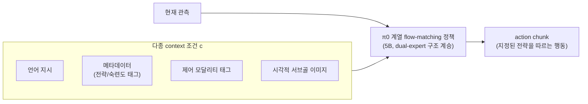

# 16. π0.7: a Steerable Generalist Robotic Foundation Model with Emergent Capabilities

- **저자/소속**: Physical Intelligence, 2026.04
- **arXiv**: [2604.15483](https://arxiv.org/abs/2604.15483)
- **한 줄 요약**: π*0.6가 "advantage(가치)"라는 단일 축으로 행동을 조건화했다면, π0.7은 언어·메타데이터·시각적 서브골 등 **훨씬 다양한 종류의 조건(context)**으로 행동 "전략(strategy)" 자체를 조종(steer)할 수 있게 만들어, 처음 보는 embodiment에서도 특화 모델 수준의 성능을 zero-shot으로 낸 최신 π 계열 모델.

이전 논문: [07. π*0.6](07-pi06.md)

---

## 1. 문제의식

π*0.6(RECAP)은 "advantage가 높은 행동을 생성하라"는 **하나의 스칼라 조건**으로 정책을 유도했다. 그런데 실제로 같은 태스크를 수행하는 방법(strategy)은 여러 가지일 수 있다 — 옷을 개는 순서, 에스프레소 머신을 조작하는 절차 등은 "정답 하나"가 아니라 **맥락에 따라 달라지는 다양한 전략의 집합**이다.

기존 모방학습의 근본적 문제: 학습 데이터에 같은 태스크를 서로 다른(때로는 비효율적인) 전략으로 수행한 시연들이 섞여 있으면, 정책은 이걸 **평균 내버려서** 애매하고 일관성 없는 행동을 배우기 쉽다(mode averaging). 그렇다고 저품질 시연을 버리면 데이터가 줄어든다.

**핵심 질문**: 시연이 다소 비효율적이거나 다양한 전략을 담고 있어도, **"이 시연이 어떤 맥락/전략으로 수행됐는지"를 명시적으로 조건으로 달아주면** 데이터를 버리지 않고도 학습할 수 있지 않을까? 그리고 배포 시점에 그 조건을 사용자가 직접 지정해서 **원하는 전략으로 로봇을 조종(steer)**할 수 있지 않을까?

## 2. 핵심 아이디어 — 다양한 Context Conditioning

π0.7은 학습 시 각 시연에 **"무엇을 할지"뿐 아니라 "어떻게 할지"를 설명하는 다종 멀티모달 프롬프트**를 함께 붙인다:

- **언어 지시**: 기존과 동일한 태스크 설명
- **메타데이터**: 예를 들어 이 시연이 어느 정도 숙련도/속도로 수행됐는지 등 수행 특성에 대한 태그
- **제어 모달리티 정보**: 어떤 종류의 조작 전략(예: 한 손 vs 양손, 특정 도구 사용 여부)을 썼는지
- **시각적 서브골(visual subgoal) 이미지**: "이 중간 상태를 거쳐가라"는 형태의 시각적 체크포인트

학습 목적함수는 π0/π*0.6과 동일한 flow matching 손실을 그대로 쓰되, 조건 $z$ 가 이미지+언어뿐 아니라 이 다종 context $c$ 까지 포함하도록 확장된다:

$$
\mathcal{L}_{\pi 0.7} = \mathbb{E}_{\tau,\, \epsilon,\, (s,a,c) \sim \mathcal{D}}\left[\left\| v_\theta\big(a^\tau, \tau, z(s), c\big) - (a - \epsilon) \right\|^2\right]
$$

RECAP의 advantage 조건화가 "좋고 나쁨"이라는 **한 축**의 스티어링이었다면, 여기서는 **"어떤 전략으로"** 라는 훨씬 풍부한 축으로 스티어링 공간을 확장한 것이 핵심 차이다. 이렇게 하면 (1) 비효율적이거나 이질적인 시연도 "그건 이런 전략이었다"는 태그와 함께 버리지 않고 학습에 활용할 수 있고, (2) 배포 시 사용자가 원하는 context를 지정해 로봇의 행동 방식을 정밀하게 조종할 수 있다.

## 3. 규모 및 학습

- **5B 파라미터** VLA — π*0.6(5B)과 비슷한 규모의 백본을 계승, flow-matching action expert 구조 유지
- 의도적으로 **품질이 들쭉날쭉한 다양한 데이터**(서로 다른 embodiment, 서로 다른 숙련도)를 포함하되, 각 데이터에 정확한 context 라벨을 붙여 "무엇이 왜 그렇게 수행됐는지"를 모델이 구분하게 함

## 4. 실험 결과

- **Zero-shot cross-embodiment 일반화**: bimanual UR5e 로봇에 **한 번도 빨래 개기 데이터로 학습되지 않았음에도** 일관되게 빨래를 개는 데 성공 — 다른 embodiment에서 배운 "전략"이 새로운 몸체로 전이됨
- **처음 보는 환경에서의 다단계 언어 지시 수행**: 다양한 주방 가전을 다루는 멀티스텝 작업을 학습 데이터에 없던 환경에서도 수행
- **특화 RL 모델과 대등하거나 그 이상**: 에스프레소 머신 조작처럼 정밀도가 요구되는 어려운 태스크에서, **태스크별로 RL로 파인튜닝된 전문가 모델과 같은 성공률**, 경우에 따라 **더 높은 처리량(throughput)**을 하나의 범용(generalist) 모델로 달성 — 빨래 개기·에스프레소 제조·박스 접기를 **하나의 π0.7 모델**로 모두 수행

## 5. Physical AI 지형에서의 위치

π0(연속 행동 생성) → π0.5(계층적 추론+환경 일반화) → π*0.6(RL 기반 지속 개선) → **π0.7(다종 context로 전략 자체를 조종)** 으로 이어지는 흐름은, "정책이 무엇을 할지"를 넘어 **"정책이 그것을 어떻게 할지"** 까지 사용자가 통제할 수 있는 방향으로 VLA가 계속 확장되고 있음을 보여준다. 이는 상용 배포 시 중요한 요구사항(안전 규정에 맞는 특정 방식으로만 동작하게 강제하기 등)과 직결된다.

**다음**: [17. Kairos](17-kairos.md) — "행동 생성(VLA)"과 "세계 예측(WFM)"을 아예 하나의 네이티브 스택으로 통합하려는 2026년의 새로운 시도.
