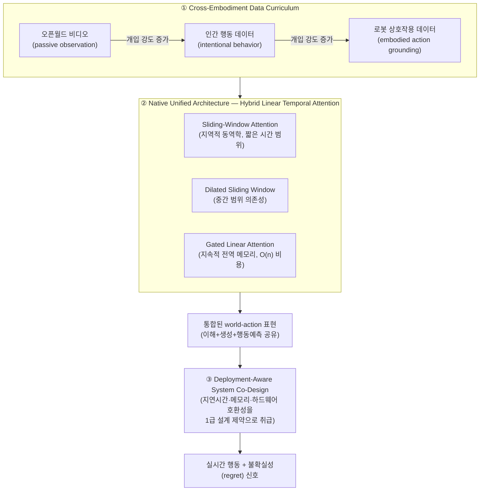

# 17. Kairos: A Regret-Aware Native World-Action Model Stack for Physical AI

- **저자/소속**: ACE Robotics, 2026.06
- **arXiv**: [2606.16533](https://arxiv.org/abs/2606.16533)
- **한 줄 요약**: 지금까지 별개로 발전해온 "세계 예측(World Model, Cosmos류)"과 "행동 생성(Action Model, GR00T/π류)"을 **하나의 네이티브 아키텍처**로 통합하고, 모델이 스스로 "내 예측이 틀릴 수도 있다"는 불확실성(regret)까지 관리하게 만든 2026년의 통합 시도.

이전 논문: [16. π0.7](16-pi07.md)

---

## 1. 문제의식 — World Model과 Action Model은 왜 갈라져 있었나

지금까지의 흐름을 정리하면:

- **Action 축**(RT-1 ~ π0.7): "관측 → 행동"을 직접 학습. 세계가 어떻게 변할지는 명시적으로 모델링하지 않음
- **World 축**([Cosmos](10-cosmos.md), [Cosmos-Predict2.5](11-world-simulation.md)): "행동 → 미래 관측"을 예측하지만, 그 자체로는 행동을 생성하지 않고 정책 학습을 위한 synthetic 데이터/시뮬레이터 역할만 함

Kairos의 문제의식: **이 둘을 인위적으로 나눠 각각 별도 모델로 학습·서빙하는 것 자체가 비효율적**이라는 것. 로봇이 잘 행동하려면 어차피 "이 행동을 하면 세계가 어떻게 될지"를 내부적으로 예측할 수 있어야 하고, 세계를 잘 예측하려면 "행동이 무엇을 의미하는지"를 이해해야 한다 — 그러니 **이해(understanding) + 생성(generation) + 행동 예측(action prediction)을 하나의 네이티브 아키텍처**로 합치자는 것이다.

또한 Kairos는 Cosmos류의 "미래 픽셀을 통째로 정확히 재현하려는" 접근 자체에 의문을 제기한다: **물리 세계 모델이 굳이 모든 미래 픽셀을 시뮬레이션할 필요는 없고, 로봇 제어에 실제로 중요한 정보만 유지하면 된다**는 것이 설계 철학이다 — 물체 상태, 공간적 관계, 접촉 조건, 태스크 진행도, 행동의 결과, 실패 경계(failure boundary), 그리고 **배포 시 불확실성(deployment uncertainty)**.

## 2. 세 가지 축으로 구성된 아키텍처

### 2.1 ① Cross-Embodiment Data Curriculum — "개입 강도"에 따른 커리큘럼

GR00T의 data pyramid가 "정적인 계층(layer)"으로 데이터를 나눴다면, Kairos는 이를 **"개입 강도(intervention strength)"라는 하나의 축을 따라가는 커리큘럼**으로 재구성한다:

1. **수동적 관찰(passive physical observation)**: 오픈월드 비디오 — 행동 라벨이 전혀 없는, 그냥 세계가 어떻게 돌아가는지 보여주는 데이터
2. **의도적 행동(intentional behavior)**: 사람이 목적을 갖고 움직이는 행동 데이터 — 행동의 "의도"는 있지만 로봇 action으로 직접 매핑되지는 않음
3. **체화된 행동 그라운딩(embodied action grounding)**: 실제 로봇의 관측-행동 쌍 — 가장 개입 강도가 높고 로봇 제어에 직접적인 데이터

학습은 이 순서(약한 개입 → 강한 개입)를 따라 커리큘럼 형태로 진행되어, 모델이 먼저 "세계가 어떻게 돌아가는지"에 대한 일반적 이해를 쌓은 뒤 점진적으로 "행동이 결과에 어떻게 연결되는지"를 배우게 한다.

### 2.2 ② Hybrid Linear Temporal Attention — 멀티 타임스케일 상태 유지

비디오/로봇 상태처럼 긴 시간축을 가진 시퀀스를 표준 full self-attention으로 처리하면 시퀀스 길이에 대해 $O(n^2)$ 비용이 들어 실시간 배포에 부적합하다. Kairos는 세 가지 경로를 병렬로 결합한 **hybrid 어텐션**으로 이를 우회한다 (아래는 이 계열 기법들의 일반적 원리를 정리한 것):

- **지역(local) 경로 — Sliding-Window Attention**: 각 타임스텝이 최근 $w$개 스텝에만 attend — 접촉(contact)이 생기고 사라지는 것 같은 **짧은 시간 범위의 동역학**을 포착
- **중간범위(mid-range) 경로 — Dilated Sliding Window**: 일정 간격으로 띄엄띄엄(dilated) 떨어진 과거 스텝들에 attend — 반복적이거나 중간 주기의 패턴(예: 보행 사이클, 다단계 작업의 서브태스크 전환)을 적은 계산량으로 포착
- **전역(global) 경로 — Gated Linear Attention**: 게이트(gate)로 조절되는 선형 recurrent 상태 $s_t$ 를 시퀀스 전체에 걸쳐 유지 — 시퀀스 길이에 비례하는 $O(n)$ 비용만으로 **"이 작업을 시작한 이후 지금까지 무슨 일이 있었는지"** 같은 장기 맥락을 압축된 형태로 계속 들고 다님

이 세 경로를 함께 써서, **지역적 반응성(reflex)** 과 **장기적 태스크 일관성(memory)** 을 모두 감당하면서도 전체 계산 비용은 표준 attention보다 훨씬 낮게 유지한다 — GR00T가 아예 두 개의 물리적으로 분리된 네트워크(System 1/2)로 이 문제를 풀었다면, Kairos는 **하나의 네트워크 안에서 시간 스케일별로 다른 어텐션 패턴을 병렬로 두는 방식**으로 접근한다는 점이 대비된다.

### 2.3 ③ Deployment-Aware System Co-Design

지연시간(latency), 메모리 사용량, 하드웨어 호환성을 아키텍처 설계 **이후에 최적화하는 대상이 아니라, 애초에 아키텍처를 설계할 때 함께 고려하는 1급 제약**으로 취급한다. 이 철학이 위의 hybrid attention 설계(비용이 낮은 선형/윈도우 어텐션 위주 구성) 자체에 이미 반영되어 있다.

### 2.4 "Regret-Aware" — 불확실성을 명시적으로 관리

이름에 들어간 "regret-aware"는 모델이 **자신의 예측이 틀릴 수 있는 지점(failure boundary)과 그 정도(deployment uncertainty)를 명시적인 출력으로 함께 내놓는다**는 의미다. 즉 "이 상황에서 이렇게 행동하겠다"뿐 아니라 "이 예측을 얼마나 신뢰할 수 있는가"까지 모델링해, 불확실성이 높은 상황에서 더 보수적인 행동을 택하거나 개입을 요청하는 식의 대응이 가능해지는 것을 목표로 한다.

## 3. 실험 결과

- **4B 파라미터** 규모의 native cross-embodiment world-action model
- **4개의 글로벌 embodied-intelligence 벤치마크에서 1위**: RoboTwin 2.0, LIBERO-Plus, WorldModelBench Robot, DreamGen — 평가된 world model 및 VLA 시스템들의 공개 리더보드 기준(2026.06.12 시점)
- 복잡한 로봇 조작(manipulation), 장면 수준 일반화(scene-level generalization), 물리 세계 모델링, zero-shot 전이라는 embodied intelligence의 핵심 능력 전반에서 선두
- Long-horizon 생성, 추론 효율성 평가에서도 **효율성 대비 성능(efficiency-to-capability trade-off)** 이 우수하다고 보고됨

## 4. 한계 및 Physical AI 학습 여정 전체 마무리

- Kairos의 "필요한 정보만 유지한다"는 철학은 계산 효율 면에서 매력적이지만, **정확히 무엇이 "제어에 충분한 정보"인지를 사전에 규정하기 어려운 태스크**(예: 미학적 판단이 필요한 작업)에서는 정보 손실의 위험이 있을 수 있음
- "Regret-aware" 불확실성 추정이 실제로 안전한 fallback 행동으로 잘 이어지는지는 실제 배포 환경에서의 장기적 검증이 필요
- 아직 초기 단계(2026년 상반기 공개)의 연구라, GR00T/π 계열만큼 광범위한 커뮤니티 검증과 3rd-party 재현이 누적되지는 않은 상태

**Physical AI 전체 지형 업데이트**: RT-1의 discrete action bin에서 시작한 이 여정은 이제 π0.7의 "전략까지 조종 가능한 정책"과 Kairos의 "world model과 action model의 네이티브 통합"이라는 두 최전선으로 수렴하고 있다. 두 흐름 모두 궁극적으로는 같은 목표 — **"로봇이 세계를 이해하고, 그 이해에 기반해 신뢰할 수 있게 행동하도록 만드는 것"** — 을 서로 다른 경로로 추구하고 있다는 점에서, 앞으로도 두 축이 계속 수렴해갈 가능성이 높다.
